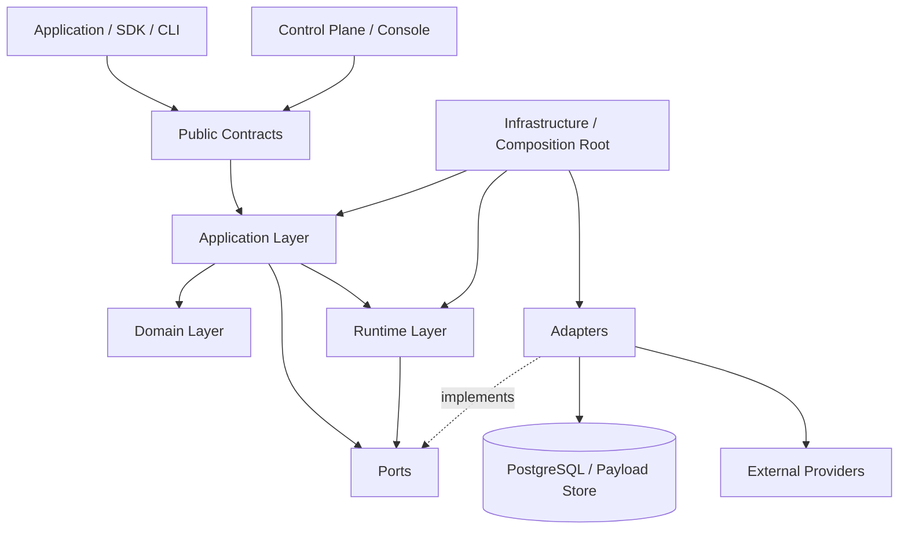

# RhinoQ architecture

This document is the implementation blueprint for RhinoQ: module boundaries,
dependencies, runtime responsibilities and the conditions for scaling. The
product contract and implementation status live in [`README.md`](./README.md)
and [`docs/`](./docs/).

The current product baseline is a **Task Platform with an optional Verified
Tasks capability**. `Task` is the user-facing abstraction; `Job` remains the
existing execution/runtime primitive in the first slice. Verified Tasks reuse
the Effect Ledger, Outcome, Rule and Finding modules when a task must prove a
business result. See [`.ai/PRODUCT_BASELINE.md`](./.ai/PRODUCT_BASELINE.md) and
ADR-0014 for the baseline decision.

```text
Task 1:N Execution
Execution 0:1 Job
Execution 0:N ProviderOperation
Task 0:1 VerifiedTaskPolicy
```

Task, Execution/Job, Effect and Outcome are independent state machines. A
provider integration supplies external-operation lifecycle and evidence; the
application still owns business logic.

**Language decision:** Go is the authoritative engine/runtime and implements
the official CLI. Node.js/TypeScript is a developer-facing SDK for producers,
worker lifecycle and operator APIs. Correctness does not move into the SDK.

## 1. Principles

1. The Domain does not know PostgreSQL, Redis, HTTP, the CLI or a framework.
2. Application coordinates use cases through ports and does not call adapters
   directly.
3. Runtime owns scheduling, leases, retry timing, concurrency and process
   lifecycle.
4. The Effect Ledger is authoritative evidence for declared effects; never
   infer confirmation from logs or a callback return.
5. An Outcome observation is evidence for business verification. It is not
   execution success and does not own the application's business record.
6. The control plane can operate the system but must not contain worker
   business logic.
7. Every boundary has a versioned contract, idempotency and telemetry.
8. Scale from measured bottlenecks; do not split services because the tree has
   many directories.

## 2. Layer model



### Layer 1 — Public Contracts

This layer contains stable types and protocols visible to adopters:

- `JobDefinition`, `JobPayload` and `JobContext`;
- versioned `TaskSnapshot` with `schemaVersion` and `entityVersion`;
- `TaskProgress`, `TaskExecutionSummary` and command preconditions;
- `EffectDefinition`, `ConfirmationPolicy` and `EffectState`;
- `OutcomeContract`, `OutcomeState`, `RetryPolicy`, `Lease` and `Attempt`;
- `Finding`, `RepairPlan`, error envelopes, event envelopes, correlation and
  tenant context.

Contracts contain no implementation. They are versioned and have a documented
backward-compatibility policy. `TaskSnapshot.entityVersion` is the aggregate
revision: Task mutations and Execution create/update operations must increment
it in the same store transaction. Incrementing only `Execution.Version` would
make stale-response rejection in the frontend unsound.

### Layer 2 — Domain (Go)

The Domain contains pure RhinoQ invariants:

- job, attempt, effect and outcome state machines;
- Rule version/scope/status and Finding lifecycle;
- transition conditions and retry classification;
- fail-closed handling for unknown/uncertain results;
- idempotency scope, effect fencing and replay/resume/repair eligibility.

Domain accepts input and returns decisions/events. It does not query a database
or call a provider.

### Layer 3 — Application (Go)

Application owns use cases, transaction boundaries and product orchestration:

- `EnqueueJob`, `ClaimJobs`, `RunAttempt`;
- `BeginEffect`, `ConfirmEffect`, `VerifyOutcome`;
- `RegisterRule`, `ExplainRule`, `EvaluateRule` and Finding projection;
- `RetryJob`, `ResumeJob`, `RepairJob`;
- `PauseQueue`, `DrainQueue` and `CancelJob`.

Application calls ports, coordinates Domain with Runtime and decides which
operations must commit atomically. Transaction scripts belong here, not in an
adapter.

### Layer 4 — Runtime/Agent (Go)

Runtime contains mechanisms that can scale independently:

- delayed-job scheduling and timing;
- claim batches, leases, heartbeats and fencing tokens;
- worker pools, concurrency and resource classes;
- retry/backoff/jitter/rate limiting;
- graceful shutdown, cancellation and poison-job protection;
- local execution and process isolation.

Runtime does not decide business outcomes. It emits execution observations and
records them through Application.

### Layer 5 — Ports (Go interfaces)

Ports describe capabilities needed by the core without exposing SQL clients,
ORM models or HTTP responses. Examples include `JobStore`, `EffectStore`,
`OutcomeVerifier` and `Clock`.

```go
type JobStore interface {
    Enqueue(ctx context.Context, input EnqueueInput) (JobID, error)
    Claim(ctx context.Context, input ClaimInput) ([]ClaimedJob, error)
    Complete(ctx context.Context, input CompleteInput) error
}
```

### Layer 6 — Adapters (Go)

Adapters implement ports and translate external systems:

- PostgreSQL job, effect, outcome, Rule and Finding stores;
- migration and read-only Rule explain/evaluate adapters;
- provider HTTP, Stripe, S3 and provisioning adapters;
- metadata adapters for Drizzle and Prisma;
- metrics/tracing, console HTTP, gRPC agent and CLI adapters.

Adapters do not contain retry business rules, repair logic or Domain
invariants. Rule SQL is executed only after Domain/Application validation, in a
read-only transaction with a local statement timeout and hard result limit.
The database role remains a required security boundary.

### Layer 7 — Infrastructure

Infrastructure is the only layer that knows frameworks and environment details.
It contains dependency injection/composition roots, configuration and secret
references, connection pools, logging/metrics/tracing, migrations and
health/readiness/liveness wiring.

## 3. Dependency rules

```text
interfaces → public facade → application → domain
                         └→ runtime     → domain
application/runtime → ports ← adapters
infrastructure → composition root + adapters
```

- `domain` imports only the standard library, domain siblings or contracts.
- `contracts` contains data, versions and pure validation; Domain-to-contract
  mapping belongs in Application.
- `application` imports Domain, contracts and ports.
- `runtime` imports Domain, contracts and ports.
- `adapters` implement ports and do not import Application internals.
- Console, CLI and SDK call the public Application facade, never a store.
- A reverse dependency uses an event or port, never a circular import.

`tests/unit/architecture_test.go` enforces these directions. Add a rule to that
gate when introducing a new boundary instead of bypassing it with a shared
utility.

## 4. Repository shape

```text
cmd/
  rhinoq-agent/       # optional authenticated HTTP Gateway
  rhinoq-worker/      # native worker process
  rhinoq/             # official CLI
internal/
  contracts/ domain/ application/ runtime/ ports/
  adapters/ infrastructure/ interfaces/
proto/rhinoq/v1/
sdks/node/            # producer, worker lifecycle and operator SDK
tests/unit/ tests/contract/ tests/integration/ tests/fault/ tests/benchmark/
```

Features should be vertical slices across these layers. Do not create a single
`services/` directory containing every kind of logic.

## 5. Data flows

### Enqueue

```text
Application request
  → validate contract
  → business transaction
  → insert job intent + idempotency key
  → commit
  → worker claim
```

When the queue is outside PostgreSQL, use a local outbox. Do not dual-write a
business database and a queue directly.

### Execute an effect

```text
claim attempt
  → begin effect(pending)
  → execute provider
  → request accepted / effect confirmed / uncertain
  → persist transition with fencing token
```

`confirm` is an explicit policy: `on-return`, `external-signal`, `verify` or a
predicate. A provider `202 Accepted` is not automatically `confirmed`.

### Verify an outcome

```text
effect confirmed or execution complete
  → schedule notBefore
  → verify indexed contract / signal
  → pending | achieved | mismatch | unverifiable | stale
  → Finding / recovery action if needed
```

`notBefore` defaults to `0`. Telemetry may suggest configuration but does not
apply it automatically.

## 6. Deployment boundaries

### V0.1 — Go authoritative engine + Node preview

There are three supported deployment paths:

- Go producer/worker uses embedded `pkg/rhinoq` and PostgreSQL, with no Gateway;
- Node producer uses `PostgresProducer` on the application's pool/transaction,
  with no Gateway;
- Node worker/operator uses `RhinoQWorker`/`RhinoQClient` through the optional
  HTTP Gateway.

Go owns state transitions, leases, fencing, retry decisions and the Effect
Ledger. Node coordinates wire lifecycle and reports observations. It does not
implement a second job state machine.

### Local Workbench

Workbench lives in `internal/interfaces/workbench` and is composed by
`cmd/rhinoq`. Its HTTP handler knows only the read/action `Reader` interface;
it does not import a PostgreSQL adapter or query tables directly. Static
HTML/CSS/JavaScript is embedded in the Go binary and binds to `127.0.0.1`.
The browser never receives database credentials or payloads. Mutating actions
must use Application use cases with actor, reason and audit data.

### V0.2 — Scale the Go worker

Scale horizontally by queue/resource class. Each worker sends its registered
handler list so PostgreSQL filters queues before locking candidates.

```text
API replicas  → PostgreSQL
Worker pool   → PostgreSQL
Console       → read API / operator API
```

### V0.3 — Separate the control plane

When Console, reconciliation or history queries affect the primary workload,
separate Console API from the worker write path, add a read model/read replica
for history and run reconciliation separately. The Effect Ledger and state
transitions remain in the authoritative store.

### V1 — Additional SDKs

Add Python/Java/.NET only when adoption evidence justifies it. SDKs speak the
versioned protocol; authoritative correctness remains in Go.

## 7. Data strategy

| Data type | Purpose | Rule |
|---|---|---|
| Hot state | claim, lease and current status | small indexes and fenced updates |
| Evidence | attempts, effects, outcome observations and audit | append-only with retention/partitioning |
| Payload | large input/output and secret references | object storage or a separate payload table |

Console must not run heavy history queries against hot state. Build a read
model from evidence/events when read scale requires it.

Important state transitions carry `job_id`, `attempt_id`, `effect_id`,
`tenant_id`, `correlation_id`, handler/contract versions, database time,
fencing epoch and actor/source.

## 8. Scaling and upgrade rules

1. Measure claim latency, DB connections, WAL, lock waits, outcome query cost
   and provider latency before splitting a service.
2. Scale reads with indexes/read models before scaling the write database.
3. Scale workers by resource class rather than raising global concurrency.
4. Handlers are idempotent or protected by the Effect Ledger.
5. Migrations use expand → migrate → contract; old and new workers coexist.
6. Contract changes add a version; never change the meaning of an existing
   field in place.
7. Every release has a rollback handler, migration plan and protocol plan.
8. Console and repair cannot bypass Application use cases.

## 9. Test gates

- **Unit:** Domain transitions, retry classification, confirmation and outcome.
- **Contract:** ports/adapters, SDK protocol, ORM metadata and providers.
- **Integration:** PostgreSQL transactions, lease expiry, outbox and migration.
- **Fault:** worker loss during effects, database outage, duplicate delivery,
  retry storms and clock skew.
- **Benchmark:** claim, enqueue, Effect Ledger overhead, outcome batches and
  payload size with hardware/workload/script recorded.
- **Release:** compatibility, security, tenant isolation and restore/readiness.

Do not call the system production-ready without reproducible fault-test logs and
benchmarks. No throughput, latency or reliability promise is made without the
matching evidence.

## 10. Accepted decisions

- PostgreSQL is the default authoritative store.
- Redis/brokers are transport adapters, not business truth.
- Application facade is the only API for CLI, Console, SDK and worker actions.
- Effect Ledger and Outcome are core modules, enabled for the jobs/effects that
  need them.
- The control plane observes and requests actions through Application commands.
- A Go modular monolith is the starting point; process/service splits require
  measured bottlenecks.
- Node SDK does not contain job state machines, retry decisions or Effect
  Ledger correctness. Worker lifecycle only carries fencing data and reports
  observations to the Go engine.

Replacing PostgreSQL, a provider, transport, Workbench or SDK language should
not require rewriting Domain and Application. That boundary is the reason
RhinoQ can scale while remaining repairable.
