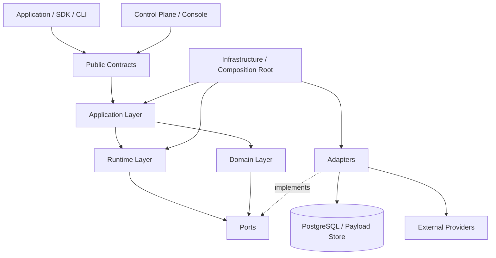

# RhinoQ — Kiến trúc chuẩn

Tài liệu này là blueprint triển khai cho RhinoQ. `RHINOQ.md` mô tả product/architecture spec; file này mô tả cách chia module, dependency, runtime và lộ trình scale để hệ thống còn dễ sửa chữa, nâng cấp.

**Quyết định ngôn ngữ:** Go là authoritative engine/runtime. TypeScript là SDK, CLI developer-facing và adapter cho ứng dụng Node.js. Correctness không nằm trong SDK.

## 1. Nguyên tắc nền

1. Domain không biết PostgreSQL, Redis, HTTP, CLI hay framework.
2. Application chỉ điều phối use case qua port, không gọi adapter trực tiếp.
3. Runtime chịu trách nhiệm scheduling, lease, retry, concurrency và process lifecycle.
4. Effect Ledger là nguồn evidence có thẩm quyền cho effect đã khai báo; không suy đoán confirmation từ log hoặc callback return.
5. Outcome observation là evidence cho business verification; không đồng nhất với execution success và không chiếm ownership của business record.
6. Control plane có quyền vận hành nhưng không được chứa business logic của worker.
7. Mọi boundary đều có contract version, idempotency và telemetry.
8. Scale theo bottleneck thực tế; không tách service chỉ vì thấy nhiều thư mục.

## 2. Mô hình tầng chuẩn



### Tầng 1 — Public Contracts (Protocol)

Chứa các kiểu dữ liệu và giao thức ổn định mà người dùng nhìn thấy:

- `JobDefinition`, `JobPayload`, `JobContext`
- `EffectDefinition`, `ConfirmationPolicy`, `EffectState`
- `OutcomeContract`, `OutcomeState`
- `RetryPolicy`, `Lease`, `Attempt`, `Finding`, `RepairPlan`
- error envelope, event envelope, correlation và tenant context

Không đặt implementation vào đây. Contract phải có version và backward-compatibility policy.

### Tầng 2 — Domain (Go)

Chứa invariant thuần nghiệp vụ của RhinoQ:

- state machine của job, attempt, effect và outcome
- Rule version/scope/status và Finding lifecycle
- điều kiện chuyển trạng thái
- retry classification
- quy tắc fail-closed khi unknown/uncertain
- idempotency scope và effect fencing
- eligibility của replay, resume, repair

Domain nhận input và trả decision/event. Không query database và không gọi provider.

### Tầng 3 — Application (Go)

Chứa use case, transaction boundary và orchestration cấp sản phẩm:

- `EnqueueJob`
- `ClaimJobs`
- `RunAttempt`
- `BeginEffect`, `ConfirmEffect`, `VerifyOutcome`
- `RegisterRule`, `ExplainRule`, `EvaluateRule`
- fold Rule observation vào persistent Finding
- `RetryJob`, `ResumeJob`, `RepairJob`
- `PauseQueue`, `DrainQueue`, `CancelJob`

Application gọi các port, phối hợp Domain với Runtime và quyết định commit nào cần atomic. Đây là nơi đặt transaction script, không phải trong adapter.

### Tầng 4 — Runtime/Agent (Go)

Chứa cơ chế thực thi có thể scale độc lập:

- scheduler và timing wheel cho delayed jobs
- claim batch, lease, heartbeat và fencing token
- worker pool, concurrency và resource class
- retry/backoff/jitter/rate limit
- graceful shutdown, cancellation và poison-job protection
- local execution và process isolation

Runtime không được tự quyết định business outcome. Nó chỉ phát job execution và ghi nhận observation qua Application.

### Tầng 5 — Ports (Go interfaces)

Các interface mà core cần, ví dụ:

```ts
interface JobStore {
  enqueue(input: EnqueueInput): Promise<JobId>;
  claim(input: ClaimInput): Promise<ClaimedJob[]>;
  complete(input: CompleteInput): Promise<void>;
}

interface EffectStore {
  begin(input: BeginEffectInput): Promise<EffectRecord>;
  transition(input: EffectTransition): Promise<void>;
}

interface OutcomeVerifier {
  verify(
    contract: OutcomeContract,
    context: VerifyContext,
  ): Promise<OutcomeObservation>;
}

interface Clock {
  now(): Promise<DatabaseTime>;
}
```

Port chỉ mô tả capability, không để lộ SQL client, ORM model hoặc HTTP response.

### Tầng 6 — Adapters (Go)

Các implementation có thể thay thế:

- `postgres-job-store`
- `postgres-effect-store`
- `postgres-outcome-store`
- `postgres-rule-store`, read-only `postgres-rule-explainer/evaluator`
- `postgres-finding-store`
- `postgres-migration`
- `provider-http`, `provider-stripe`, `provider-s3`
- `drizzle-metadata`, `prisma-metadata`
- `prometheus-metrics`, `opentelemetry-tracing`
- `console-http`, `grpc-agent`, `cli`

Adapter dịch dữ liệu giữa external system và port. Không đặt retry business, repair logic hoặc invariant vào adapter.

Rule SQL adapter chỉ thực thi contract do domain/application đã validate. Nó
phải dùng read-only transaction, local statement timeout và hard result limit;
database role bị giới hạn vẫn là security boundary bắt buộc.

### Tầng 7 — Infrastructure (Go + deployment)

Chứa wiring và vận hành:

- dependency injection/composition root
- config loading và secret references
- connection pool
- logging, metrics, tracing
- migrations
- health/readiness/liveness
- process bootstrap

Infrastructure là nơi duy nhất biết framework, environment variable và cách khởi động process.

## 3. Dependency rule bắt buộc

```text
interfaces → public facade → application → domain
                         └→ runtime     → domain
application/runtime → ports ← adapters
infrastructure → composition root + adapters
```

Quy tắc import:

- `domain` chỉ import `contracts`.
- `application` import `domain`, `contracts`, `ports`.
- `runtime` import `domain`, `contracts`, `ports`; public facade/composition root khởi tạo runtime.
- `adapters` implement `ports`; không được import ngược `application` để gọi use case nội bộ.
- `console`, `cli`, `sdk` gọi public application facade, không truy cập store trực tiếp.
- Không dùng shared utility để phá dependency rule; utility phải thuộc đúng tầng.

Nếu cần một chiều ngược, dùng event hoặc port, không dùng import vòng.

## 4. Cấu trúc repository đề xuất

```text
cmd/
  rhinoq-agent/
  rhinoq-worker/
  rhinoq-cli/
internal/
  domain/
  application/
  runtime/
  ports/
  adapters/
  infrastructure/
proto/
  rhinoq/v1/
sdks/
  typescript/
    src/
  python/       # sau này
tests/
  unit/
  contract/
  integration/
  fault/
  benchmark/
```

Mỗi feature nên đi theo vertical slice bên trong các tầng: `enqueue`, `effect`, `outcome`, `recovery`. Không tạo một thư mục khổng lồ kiểu `services/` chứa mọi logic.

Sơ đồ sequence chuẩn để review implementation và vẽ Console nằm tại [`docs/runtime-flows.md`](docs/runtime-flows.md).

## 5. Luồng dữ liệu chuẩn

### Enqueue

```text
Application request
  → validate contract
  → business transaction
  → insert job intent + idempotency key
  → commit
  → worker claim
```

Nếu queue nằm ngoài database, dùng local outbox. Không dual-write trực tiếp giữa business database và queue.

### Execute effect

```text
claim attempt
  → begin effect(pending)
  → execute provider
  → request accepted / effect confirmed / uncertain
  → persist transition with fencing token
```

`confirm` phải là policy explicit: `on-return`, `external-signal`, `verify`, hoặc predicate. Provider trả `202` không tự động là confirmed.

### Verify outcome

```text
effect confirmed hoặc execution complete
  → schedule notBefore
  → verify indexed contract / signal
  → pending | achieved | mismatch | unverifiable | stale
  → finding / recovery action nếu cần
```

`notBefore` mặc định là `0`. Telemetry chỉ được dùng để đề xuất cấu hình, không tự apply.

## 6. Ranh giới triển khai

### V0.1 — Go modular monolith + TypeScript SDK

Chạy một codebase và hai process:

- Go Agent/Worker/Runtime
- TypeScript SDK làm Producer client
- PostgreSQL dùng chung
- Console API có thể nằm trong Agent process

Đây là cấu hình mặc định. Tách module bằng code boundary trước, chưa tách network boundary.

### V0.2 — Scale Go worker

Scale ngang Go worker theo queue/resource class. TypeScript app chỉ gọi protocol; không chạy correctness logic trong process ứng dụng.

```text
API replicas  → PostgreSQL
Worker pool   → PostgreSQL
Console       → read API / operator API
```

### V0.3 — Tách control plane

Khi Console, reconciliation hoặc query history ảnh hưởng workload chính:

- tách Console API khỏi worker write path
- read replica/read model cho history
- background reconciliation riêng
- vẫn giữ Effect Ledger và state transition ở authoritative store

### V1 — SDK đa ngôn ngữ

Agent đã là Go core từ v0.1. Chỉ thêm Python/Java/.NET SDK khi có nhu cầu; các SDK chỉ nói protocol, correctness vẫn nằm ở Agent authoritative service.

## 7. Chiến lược dữ liệu

Tách rõ ba loại dữ liệu:

| Loại      | Mục đích                                       | Quy tắc                                 |
| --------- | ---------------------------------------------- | --------------------------------------- |
| Hot state | claim, lease, current status                   | index nhỏ, update có fencing            |
| Evidence  | attempts, effects, outcome observations, audit | append-only, partition/retention        |
| Payload   | input/output lớn, secret reference             | object storage hoặc payload table riêng |

Không để Console query trực tiếp bảng hot với truy vấn lịch sử nặng. Khi cần scale read, xây read model từ event/evidence.

Mọi state transition quan trọng phải có:

- `job_id`, `attempt_id`, `effect_id`
- `tenant_id`, `correlation_id`
- `handler_version`, `contract_version`
- `occurred_at` theo database time
- fencing/epoch
- actor/source

## 8. Quy tắc scale và nâng cấp

1. Đo trước khi tách: claim latency, DB connections, WAL, lock wait, outcome query cost, provider latency.
2. Scale read bằng index/read model trước khi scale write database.
3. Scale worker theo resource class, không tăng concurrency toàn cục.
4. Handler phải idempotent hoặc được bảo vệ bằng Effect Ledger.
5. Schema migration dùng expand → migrate → contract; worker cũ và mới phải chạy đồng thời được.
6. Event/contract đổi bằng version mới; không đổi nghĩa field cũ tại chỗ.
7. Mỗi release phải có rollback handler, migration và protocol.
8. Không cho console/repair bypass application use case.

## 9. Test gate theo tầng

- **Unit:** domain transition, retry classification, confirmation policy, outcome state.
- **Contract:** ports/adapters, SDK protocol, ORM metadata và provider adapter.
- **Integration:** PostgreSQL transaction, lease expiry, outbox, migration.
- **Fault:** kill worker giữa effect, DB outage, duplicate delivery, retry storm, clock skew.
- **Benchmark:** claim, enqueue, effect ledger overhead, outcome batch, payload size; luôn ghi hardware/workload/script.
- **Release:** backward compatibility, security, tenant isolation, restore/readiness.

Không gọi hệ thống “production-ready” nếu chưa có fault-test logs và benchmark tái lập.

## 10. Quyết định kiến trúc chốt

- PostgreSQL là authoritative store mặc định.
- Redis/broker chỉ là adapter/transport tùy deployment, không chứa business truth.
- Application facade là API duy nhất cho CLI, Console, SDK và worker.
- Effect Ledger và Outcome contract là module lõi, nhưng chỉ bật theo job/effect cần thiết.
- Control plane chỉ quan sát và yêu cầu action qua application command.
- Go modular monolith là điểm bắt đầu; tách process/service là bước scale có điều kiện.
- TypeScript SDK không được chứa job state machine, lease, retry engine hoặc Effect Ledger correctness.

Với mô hình này, thay PostgreSQL, provider, ORM, transport, Console hoặc ngôn ngữ SDK không buộc phải viết lại Domain và Application. Đó là boundary quan trọng nhất để RhinoQ có thể scale mà vẫn sửa chữa được.
