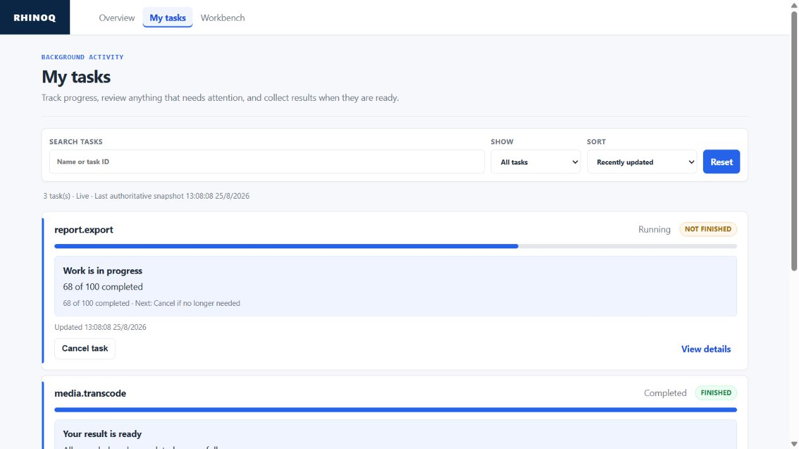

# RhinoQ

Documentation: **English** · [Tiếng Việt](./docs/vi/README.md)

**Turn background jobs into Tasks your users can follow and your team can
operate safely.**

RhinoQ adds durable status, progress, history, cancellation, results and a
user-facing Task Center around asynchronous work. Operators get a Workbench
that explains what ran, what failed and what still needs confirmation.

Keep an existing BullMQ runtime, use RhinoQ's native PostgreSQL queue, or
connect another runtime through the Node adapter contract.

[](https://github.com/madebyduy/RhinoQ/actions/workflows/ci.yml)
[](https://github.com/madebyduy/RhinoQ/actions/workflows/security.yml)
[](https://www.npmjs.com/package/@rhinoq/node)


> [!WARNING]
> RhinoQ is a public beta for evaluation and controlled pilots. It does not
> claim a production SLA. Read [production readiness](./docs/production-readiness.md)
> before using it for real workloads.

Latest verified public prerelease: `v0.1.0-beta.23`.

## The problem RhinoQ solves

A user starts an export, import, media conversion or provider operation. The
HTTP request ends, but the real work continues somewhere else.

Without a Task layer, the application team usually has to build and maintain:

- a status table and polling endpoints;
- progress, retry and cancellation behavior;
- result access and authorization;
- a user-facing history page;
- operator tooling for failures and stuck work;
- rules for deciding whether a timed-out external operation is safe to repeat.

RhinoQ provides that product and operations layer without requiring every team
to replace its existing worker runtime.

| Before RhinoQ | With RhinoQ |
|---|---|
| A queue job is an internal implementation detail | A durable Task has an owner, progress, history and result metadata |
| Users refresh, ask support or start the work again | Users follow work in the Task Center through SSE with polling fallback |
| Support correlates logs and queue records manually | Workbench joins Task, execution stages and available evidence |
| A request timeout is easily mistaken for a failed operation | Unknown external results become `uncertain` and are not retried blindly |
| Adopting a product layer means replacing the queue | BullMQ can stay in place; PostgreSQL and custom runtimes are also supported |

## See the product in 30 seconds

```bash
npx rhinoq dev --demo
```

This opens a disposable Workbench with synthetic running, completed and failed
Tasks. It needs no database, Redis or provider credentials and writes no
integration into your application.

The user-facing Task Center turns background activity into a clear product
experience: progress, results and work that still needs confirmation.



Operators use the Workbench to investigate the same durable work through
execution stages and available evidence.


When you want a real PostgreSQL-backed local evaluation, preview it and start
it with:

```bash
npx rhinoq up --dry-run
npx rhinoq up
```

Continue with the [five-minute local quickstart](./docs/quickstart.md) for
requirements, expected checks and cleanup.

## Why RhinoQ is different

### One Task experience for users and operators

The same durable Task state powers three surfaces:

| Surface | Default path | Audience |
|---|---|---|
| Task API | `/tasks` | authenticated application users |
| Task Center | `/task-center` | authenticated application users |
| Workbench | `/admin` | authorized operators |

Users see plain-language progress and results. Operators see execution history,
attention states and available evidence without treating UI text or logs as the
source of truth.

Authentication remains application-owned. Never expose Workbench without an
operator authorization boundary.

### Technical completion is not business correctness

A worker returning successfully does not prove that a file exists, a payment
settled or a provider accepted the intended change. RhinoQ can keep execution,
external-effect confirmation and business verification as separate evidence.

If the external result is unknown, RhinoQ fails closed to `uncertain`. It does
not turn a timeout into success and does not blindly repeat a possibly completed
operation.

### Keep the runtime that already works

RhinoQ is a Task platform, not a demand to rewrite your queue:

- keep an existing BullMQ worker and Redis deployment;
- use PostgreSQL as RhinoQ's native queue;
- connect another queue through the portable runtime adapter;
- use only business verification when execution already lives elsewhere.

The Go engine and PostgreSQL own authoritative queue, lease, retry, fencing and
Effect Ledger correctness. Node.js/TypeScript provides the developer-facing
producer, composition and worker-lifecycle SDK.

## Add RhinoQ to a Node.js or NestJS application

Node.js 22 and 24 and PostgreSQL 16 are tested.

### 1. Install and preview

```bash
npm install @rhinoq/node@next pg
npx rhinoq setup
```

`setup` detects the application shape and prints the exact next command. The
preview does not overwrite application files and writes nothing until you add
`--apply`.

If you are adopting existing asynchronous code, create a read-only safety
inventory first:

```bash
npx rhinoq adopt --plan --out .rhinoq/adoption-plan.json
```

The plan finds handlers, producers, retry timers, cancellation boundaries and
possible external effects. It does not invent owner identity, idempotency keys,
provider confirmation or business rules.

### 2. Apply the reviewed setup

Run the exact `NEXT` command printed by the preview. For example:

```bash
npx rhinoq setup --runtime bullmq --mode single --apply
# or: npx rhinoq setup --runtime manual --apply
npx rhinoq doctor
```

Generated files are non-overwriting. Review and commit the resulting diff.
RhinoQ requires an explicit `single` or `fanout` mode for BullMQ because that
choice defines Task aggregation semantics, not package configuration.

### 3. Add one Task

```bash
npx rhinoq add task report.export
npx rhinoq add task report.export --apply
```

The first command previews the slice. The second creates a handler shell and a
smoke test. Replace the generated handler body with your business work, then
run:

```bash
npx rhinoq doctor --journey
```

The journey check verifies generated files only. It reports owner, tenant,
business key and result resolution as application-required; it does not claim
that PostgreSQL or a live worker is healthy.

## A minimal declared Task

```ts
import { defineRhinoQApplication } from '@rhinoq/node';

const definition = defineRhinoQApplication({
  profile: { name: 'reports', adapters: [runtimeAdapter] },
  tasks: (task) => ({
    exportReport: task({
      name: 'report.export',
      retry: { mode: 'runtime', maxAttempts: 3 },
      run: async ({ reportId }, context) => {
        await context.progress(0, 1, 'Generating report');
        const result = await generateReport(reportId);
        await context.progress(1, 1, 'Report ready');
        return result;
      },
      result: ({ url }) => ({ ref: url, mediaType: 'application/pdf' }),
    }),
  }),
});

const app = await definition.start({
  pool,
  ownerFromNodeRequest,
  http: { operatorToken: process.env.RHINOQ_OPERATOR_TOKEN },
});

await app.tasks.exportReport.dispatch({
  id: 'report-42',
  ownerId: user.id,
  payload: { reportId: '42' },
});
```

This declaration supplies Task identity, progress, result metadata and the
mounted user/operator surfaces. Your application still owns authentication,
tenant mapping, payload validation, the handler, provider credentials and the
definition of a correct business result.

See the [Node SDK guide](./sdks/node/README.md) for runtime-specific composition
and imports.

## Return now or continue as a Task

For an HTTP action, `respond()` removes the usual synchronous-result versus
polling branch:

```ts
return app.tasks.exportReport.respond({
  id: `report-${reportId}`,
  ownerId: user.id,
  tenantId: user.tenantId,
  idempotencyKey: `report:${reportId}`,
  payload: { reportId },
}, {
  waitUpToMs: 1_500,
  origin: 'https://app.example.com',
});
```

It returns `200` if the Task finishes inside the request budget, `202` with
`Location` if work continues, or `409` for a terminal failure. Expiry never
cancels or fails the Task.

Configure `createRhinoQApp({ resultResolver })` to convert a private stored
result into owner-safe response data. Without it, a successful response exposes
Task status but never the storage reference. Owner, tenant and idempotency keys
remain explicit application decisions.

Express, Nest and Fastify applications can use the route composition:

```ts
server.post('/reports/:id/export', app.tasks.exportReport.route({
  identity: request => ({
    ownerId: request.user.id,
    tenantId: request.user.tenantId,
    key: `report:${request.params.id}`,
  }),
  input: request => ({ reportId: request.params.id }),
  waitUpToMs: 1_500,
  origin: 'https://app.example.com',
}));
```

`task.identity()` hashes and namespaces the application-owned business key; it
does not invent one. A compiled application starts its declared handler router
with `started.worker(options)`, the shorter form of the graceful `runWorker`
path.

## Keep an existing BullMQ worker

RhinoQ does not replace Redis or your worker. Preview and apply one explicit
aggregation mode:

```bash
npx rhinoq connect --mode single
npx rhinoq connect --mode single --apply
```

Use `single` when one BullMQ job is one Task. Use `fanout` when one Task owns
multiple BullMQ jobs. RhinoQ refuses to guess because the wrong mode can close
a Task too early.

The compatibility preset mounts the complete surface:

```ts
import { rhinoq } from '@rhinoq/node';

const app = await rhinoq({
  pool,
  queue,
  events,
  ownerFromRequest: request => authenticatedUser(request).id,
});

server.use(app.http({
  operatorToken: process.env.RHINOQ_OPERATOR_TOKEN,
}));
```

Continue with the [BullMQ example](./examples/fanout-bullmq/README.md).

## Operate without keeping a dashboard open

```bash
npx rhinoq watch --severity warning
npx rhinoq inspect <task-id>
npx rhinoq open <task-id>
```

- `watch` prints authoritative Task changes and groups repeated incidents.
- `inspect` joins attempts, Steps, verification and available provider evidence.
- `open` deep-links to the same Task in Workbench.

Database notifications are wake-up hints only; polling remains the disconnect
fallback. For unattended production alerts, configure durable
[notification routes](./docs/notifications.md).

For the native Go queue, inspect one lane without opening a browser:

```bash
rhinoq queue health media --json
```

The snapshot is one bounded PostgreSQL read.

## What RhinoQ owns—and what it does not

| RhinoQ handles | Your application still handles |
|---|---|
| Task and Execution lifecycle | authentication and tenant identity |
| progress, history and result metadata | business handler and payload |
| owner Task API and Task Center | authorization for private results |
| Workbench and terminal inspection | provider credentials |
| reconciliation and attention states | idempotency and confirmation policy |
| optional verification and guarded recovery | definition of business correctness |

RhinoQ does not infer business identity or correctness. Those decisions remain
explicit at the application boundary.

## Add capabilities only when needed

The first integration does not require every RhinoQ feature.

| Need | Guide |
|---|---|
| resumable units inside a Task | [Durable Steps](./docs/async-task-capabilities.md) |
| large files, video or ZIP output | [Artifacts](./docs/artifact-storage.md) |
| browser updates | [Realtime](./docs/realtime.md) |
| React components | [React UI](./docs/react-ui.md) |
| verify the real business outcome | [Business verification](./docs/business-verification.md) |
| safe external effects | [Provider operations](./docs/provider-operations.md) |
| guarded operator repair | [Recovery](./docs/recovery.md) |
| adopt without runtime cutover | [Native adoption](./docs/native-adoption.md) |
| terminal operations | [Terminal operations](./docs/terminal-operations.md) |

Other supported starting points:

- [Native PostgreSQL queue](./docs/postgres-queue.md)
- [Portable runtime adapter](./examples/manual-runtime/README.md)
- [Integrity-only verification](./examples/integrity-only/README.md)
- [Realistic report-export workflow](./examples/report-export/README.md)

## When not to use RhinoQ

Do not add RhinoQ merely to run a tiny in-process callback. Keep the simpler
system if you do not need durable user-visible progress, results, recovery or
business verification.

RhinoQ is also a poor fit if you cannot operate PostgreSQL, require a Redis-only
sub-millisecond queue path, or need a general DAG/workflow language. Adopt it
when lost, duplicated, opaque or unverified background work has become the more
expensive problem.

## Before a controlled pilot

1. Pin the exact release instead of `@next`.
2. Run `npx rhinoq doctor` against the deployment database.
3. Prove owner and tenant isolation.
4. Define retry and external-effect policy explicitly.
5. Exercise cancellation, event loss and worker restart.
6. Configure retention, health checks, metrics and notification delivery.
7. Review [known limits](./docs/production-readiness.md).

RhinoQ makes no throughput, latency, reliability or production-SLA claim
without the matching reproducible evidence.

## Documentation

Start with the page matching your next action:

- [Five-minute real local quickstart](./docs/quickstart.md)
- [Existing application guide](./docs/start-here.md)
- [One-command setup](./docs/setup.md)
- [Node SDK guide](./sdks/node/README.md)
- [Native PostgreSQL queue](./docs/postgres-queue.md)
- [CLI reference](./docs/cli.md)
- [Configuration reference](./docs/configuration.md)
- [Production checklist](./docs/production-checklist.md)
- [Architecture](./ARCHITECTURE.md)
- [All documentation](./docs/README.md)

## Contributing and support

- Use [GitHub Discussions](https://github.com/madebyduy/RhinoQ/discussions) for
  integration questions.
- Use [GitHub Issues](https://github.com/madebyduy/RhinoQ/issues) for
  reproducible bugs.
- Read [CONTRIBUTING.md](./CONTRIBUTING.md) before sending a change.

Apache-2.0 licensed.
