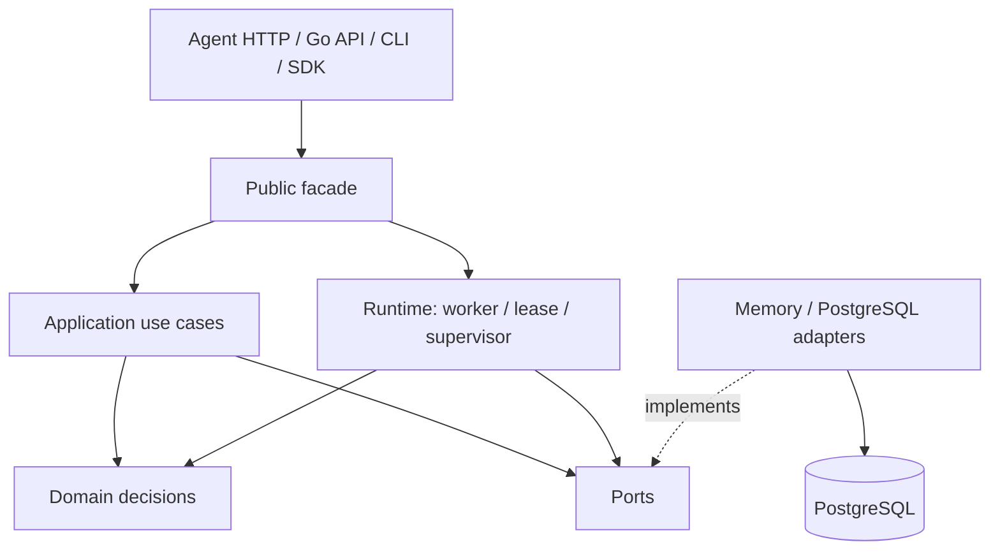

# Architecture map

Go là authoritative engine. TypeScript là developer-facing SDK. Domain không import adapter/database/framework. Xem [ARCHITECTURE.md](../ARCHITECTURE.md) để đọc dependency rule đầy đủ.

Các sequence/state diagram bám theo implementation nằm tại [Runtime flows](./runtime-flows.md).
