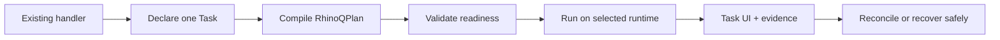

# RhinoQ — kế hoạch học điểm mạnh của Caddy và áp dụng đúng chỗ

> Ngày lập: 2026-08-14  
> Trạng thái: kế hoạch sản phẩm/kỹ thuật, chưa phải release promise  
> Phạm vi: học nguyên tắc sản phẩm, kiến trúc mở rộng, cấu hình và vận hành của
> Caddy; không sao chép web-server feature vào RhinoQ.

## 1. Kết luận ngắn

Caddy không nổi bật chỉ vì có nhiều tính năng. Giá trị lớn nhất của Caddy là
biến một hệ thống kỹ thuật phức tạp thành một lời hứa cực ngắn:

```text
Chạy web server an toàn với HTTPS tự động, ít cấu hình và ít moving parts.
```

RhinoQ cần làm tương tự với async Task:

```text
Biến business handler hiện có thành Task bất đồng bộ bền vững,
có trạng thái, progress, artifact và recovery mà không viết lại handler.
```

Điểm nên áp dụng ngay:

1. một golden path duy nhất và một product promise dễ nhớ;
2. một canonical plan bên trong, nhiều input adapter bên ngoài;
3. lifecycle và namespace thống nhất cho runtime/provider/processor;
4. validate trước, atomic apply sau, rollback khi không đạt health gate;
5. core nhỏ, extension tùy chọn, package không mang dependency không dùng;
6. tài liệu, quick start, conventions và diagnostics là một phần của sản phẩm;
7. mọi claim phải gắn evidence, không dùng số star để thay benchmark/adopter proof.

## 2. Vì sao Caddy có sức hút lớn

### 2.1 Một pain point phổ biến, giải pháp mặc định đúng

HTTPS và chứng chỉ từng là công việc lặp lại, dễ sai và ảnh hưởng trực tiếp đến
an toàn. Caddy đưa Automatic HTTPS thành mặc định thay vì một add-on. Người dùng
nhận giá trị ngay trước khi phải hiểu module system, JSON config hay admin API.

**Bài học cho RhinoQ:** trải nghiệm đầu tiên phải giải quyết một việc hoàn chỉnh,
không bắt người dùng học toàn bộ Task Platform. Hero flow nên là:

```text
existing handler
  -> declare one Task
  -> dispatch
  -> progress + result + cancel
  -> recover/reconcile when something is uncertain
```

### 2.2 Ít moving parts là một nguyên tắc sản phẩm

Caddy nhấn mạnh single binary, ít dependency và cấu hình tập trung. Mục tiêu
không chỉ là deployment đẹp mà còn giảm số biến ẩn khi debug và vận hành.

**Bài học cho RhinoQ:** không thể hứa zero dependency vì PostgreSQL/runtime và
provider là phần thật của bài toán. Nguyên tắc phù hợp hơn là:

```text
Không thêm process, datastore, credential class hoặc provider dependency
nếu capability được chọn không cần chúng.
```

Embedded PostgreSQL Task profile phải là đường mặc định. Redis/BullMQ, object
storage, GPU, processor binary và Control Plane chỉ xuất hiện khi workload chọn.

### 2.3 Một cấu hình chuẩn, nhiều cách nhập

Caddy dùng JSON làm canonical configuration. Caddyfile, YAML, TOML và các định
dạng khác được chuyển qua config adapter. Core không phải hiểu tất cả format.

**Bài học cho RhinoQ:** `defineRhinoQProject()`, application manifest, execution
capsule và data-path plan đã là nền tảng. RhinoQ cần hợp nhất chúng thành một
`RhinoQPlan` versioned, thay vì tạo thêm một DSL cạnh tranh.

### 2.4 Module lifecycle và namespace rõ ràng

Caddy module có identity, namespace, interface và lifecycle load/provision/
validate/use/cleanup. Host module chỉ cần hiểu interface của namespace đó.

**Bài học cho RhinoQ:** runtime adapter, provider adapter và processor pack cần
cùng một module vocabulary, nhưng correctness authority vẫn ở Go/Application.

### 2.5 Thay đổi cấu hình có transaction-like semantics

Caddy provision và validate cấu hình mới trước; nếu đạt mới thay cấu hình cũ.
Nếu load thất bại thì cấu hình cũ tiếp tục chạy. Điều này vừa đơn giản hóa hot
path vừa cho rollback rõ ràng.

**Bài học cho RhinoQ:** áp dụng cho application-owned operational settings như
admission, concurrency, provider rate và resource limit. Không áp dụng như một
cách sửa Task state, retry effect `uncertain` hoặc quyết định business outcome.

### 2.6 Extensibility không bắt core chứa mọi thứ

Caddy có module ecosystem và `xcaddy` để tạo build theo nhu cầu. Người dùng có
thể thêm extension mà không bắt mọi installation mang extension đó.

**Bài học cho RhinoQ:** processor/provider pack cần package độc lập, support
matrix rõ và build profile có thể tái lập. Không đưa Sharp, LibreOffice,
malware scanner, AI SDK và mọi cloud provider vào package/image mặc định.

### 2.7 Documentation là product surface

Caddy có quick start, tutorial, API reference, config reference, conventions,
architecture và extension guide tách rõ theo intent. Người mới không phải đọc
source để đoán đường dùng chuẩn.

**Bài học cho RhinoQ:** README chỉ dẫn golden path; advanced/reference chuyển
sang docs tương ứng. Không liệt kê mọi public symbol trong trải nghiệm đầu tiên.

## 3. RhinoQ đã có gì để xây tiếp

RhinoQ không bắt đầu từ số không. Repository hiện đã có các mảnh ghép phù hợp:

| Nền tảng hiện có | Có thể phát triển theo bài học Caddy |
|---|---|
| `defineRhinoQProject()` và short factories | một project entry point duy nhất |
| application manifest/execution capsule | canonical `RhinoQPlan` |
| Plan Inspector và setup preview | plan/validate/diff UX |
| runtime adapter capability | module namespace cho runtime |
| generic processor pack, FFmpeg, Sharp boundary | processor module lifecycle |
| Integration Eraser preview | config/code adaptation có warning và confidence |
| Autopilot approval/canary/rollback | atomic operational-setting apply |
| Task Center/Workbench | embedded product surface |
| Evidence Passport/Flight Recorder | explainability và troubleshooting contract |
| Go engine + PostgreSQL fencing | authoritative correctness core |

Vì các nền tảng này đã tồn tại, kế hoạch nên ưu tiên hợp nhất và thu gọn, không
tạo thêm framework tổng quát.

## 4. North-star experience của RhinoQ

### 4.1 Product promise đề xuất

```text
Keep your handler. RhinoQ adds durable async execution, progress,
artifacts and safe recovery.
```

Bản tiếng Việt:

```text
Giữ nguyên business handler. RhinoQ bổ sung thực thi bất đồng bộ bền vững,
progress, artifact và recovery an toàn.
```

### 4.2 Golden path mục tiêu



### 4.3 Complexity budget

Một golden-path change chỉ được nhận nếu ít nhất một điều đúng:

- xóa adopter-owned integration code/config/process;
- tăng correctness có test/fault evidence;
- giảm số quyết định người dùng phải đưa ra trước lần chạy đầu tiên;
- giảm dependency/package/runtime surface của capability không được chọn;
- cải thiện metric đã đo mà không làm xấu safety gate.

Nếu feature thêm nhiều code/config/process hơn phần nó xóa mà không cải thiện
correctness hoặc evidence, feature đó không được vào golden path.

## 5. Work package đề xuất

### CR-01 — Một golden path và một vocabulary

**Ưu tiên:** P0  
**Mục tiêu:** người mới hoàn thành một Task thật mà không phải chọn giữa nhiều
factory, profile hoặc adapter tương đương.

**Thiết kế:**

- README chỉ dùng `defineRhinoQProject()` và một nhóm symbol tối thiểu;
- chuẩn hóa vocabulary: Project → Task → Execution → Effect → Outcome;
- `setup`, `doctor`, `plan`, `dev`, `run` dùng cùng project discovery;
- advanced paths giữ compatibility nhưng không xuất hiện trong first-run docs;
- một reference app cài từ tarball, không import source checkout.

**Acceptance criteria:**

- từ repository có sẵn đến Task đầu tiên trong tối đa 10 phút no-coaching;
- không viết lại business handler;
- không thêm Gateway process/credential cho embedded profile;
- quick start chỉ có một cách cấu hình được khuyến nghị;
- command/path trong README chạy được từ tarball vừa build.

**Rollback:** giữ compatibility entry points và hạ change về docs-only nếu API
diet tạo breakage chưa có migration window.

### CR-02 — Canonical `RhinoQPlan`

**Ưu tiên:** P0  
**Mục tiêu:** có một representation chuẩn cho project intent và compiled
runtime facts.

**Contract tối thiểu:**

```text
schemaVersion
project/profile identity
declared Tasks và handler versions
runtime bindings và capability requirements
retry/effect/confirmation policy
data path, artifact và workspace policy
resource/admission bounds
provider/processor requirements
owner/tenant/operator surface
known limitations và evidence status
```

**Public UX:**

```bash
rhinoq plan
rhinoq plan --json
rhinoq plan --check
rhinoq plan --output rhinoq-plan.json
```

**Quy tắc:** plan là read-only; không chứa secret; output deterministic; đường
dẫn và timestamp không làm drift snapshot; Node compiles developer intent,
Go/Application vẫn sở hữu runtime correctness.

**Acceptance criteria:**

- cùng input/versions tạo cùng plan digest;
- plan chỉ ra missing capability trước khi worker chạy;
- Workbench, doctor và setup đọc cùng contract thay vì tự suy luận;
- public field có stability tag và docs owner;
- plan không chứa payload, credential hoặc private storage reference.

**Rollback:** giữ manifest hiện tại làm source và phát `RhinoQPlan` như một
projection cho đến khi contract ổn định.

### CR-03 — Input adapters cho plan, chưa tạo DSL mới

**Ưu tiên:** P1 sau CR-02  
**Mục tiêu:** chấp nhận nhiều project shape nhưng core chỉ nhận một plan.

**Adapter đầu tiên:**

- TypeScript `defineRhinoQProject()` → `RhinoQPlan`;
- setup detection → plan proposal;
- legacy application definition → plan với compatibility warning;
- JSON plan import cho tooling/CI, không phải đường viết tay mặc định.

**Không làm ngay:** YAML DSL, visual workflow DSL, NGINX-style Taskfile hoặc
auto-converter thay business code. Chỉ thêm adapter khi có adopter demand.

**Output adapter bắt buộc có:** result, warning, error, unsupported behavior và
confidence. Warning không được tự động nâng thành accepted behavior.

**Acceptance criteria:** adaptation read-only; deterministic; warning có vị trí
nguồn; unsupported behavior không bị bỏ qua; generated plan chạy validation
nhưng không tự apply.

### CR-04 — RhinoQ module namespace và lifecycle

**Ưu tiên:** P1  
**Mục tiêu:** extension có contract nhất quán, không đưa correctness vào plugin.

**Namespace đề xuất:**

```text
runtime.<name>
processor.<name>
storage.<name>
confirmation.<name>
notification.<name>
realtime.<name>
telemetry.<name>
```

**Lifecycle chung:**

```text
discover -> configure -> provision -> validate -> start/use -> drain -> cleanup
```

**Capability manifest:**

```text
module id/version/build digest
contract version
runtime/platform support
required process/binary/datastore/credential
resource estimate
cancellation/timeout behavior
readiness and health probe
cleanup/orphan policy
error classification
security/tenant boundary
support owner and rollback
```

**Ranh giới kiến trúc:**

- Go Application/Runtime quyết định lease, retry, Task transition và admission;
- SDK/module chỉ gửi intent, capability/evidence và thực thi handler lifecycle;
- external effect phải khai idempotency và confirmation;
- module không được biến timeout thành retry-safe nếu result chưa biết;
- lifecycle overlap phải được test khi thay config/module version.

**Acceptance criteria:** module không đạt validation thì không start; cleanup
không che primary failure; capability report bounded; duplicate module identity
fail closed; version mismatch có lỗi có thể hành động.

### CR-05 — Build profile và package composition kiểu `xcaddy`

**Ưu tiên:** P1 sau module contract  
**Mục tiêu:** cài đúng extension cần dùng mà không làm core package/image phình.

**UX đề xuất:**

```bash
rhinoq modules list
rhinoq modules doctor
rhinoq build-profile --with processor.ffmpeg --with storage.s3
rhinoq build-profile --lock rhinoq-modules.lock
```

Đây có thể là package/image profile generator, không nhất thiết build một binary
duy nhất. Output phải gồm exact versions, checksum, SBOM và support boundary.

**Acceptance criteria:**

- build reproducible từ lock file;
- module không chọn không xuất hiện trong dependency/image scan;
- ESM/CJS/Go binary/container smoke theo profile;
- non-root container cho binary processor;
- provenance, checksum và license inventory có trong artifact;
- upgrade/rollback profile có rehearsal.

**Rollback:** luôn giữ core distribution tối thiểu; custom profile là artifact
riêng, không thay package mặc định cho mọi adopter.

### CR-06 — Atomic operational configuration

**Ưu tiên:** P1/P2, chỉ sau evidence  
**Mục tiêu:** thay operational setting có preview, validation, canary và rollback.

**Phạm vi cho phép:**

- worker/admission concurrency trong hard cap;
- provider request rate/backoff envelope;
- resource/workspace limit;
- realtime batching/coalescing;
- processor runtime setting không đổi business meaning.

**Luồng bắt buộc:**

```text
read current
  -> compile proposed config
  -> validate
  -> show semantic diff
  -> explicit approval
  -> bounded canary
  -> observe health/SLO
  -> commit or reverse rollback
```

**Không được phép:** sửa Task/business outcome, effect confirmation, retry
`uncertain`, tenant authorization hoặc migration contract qua Autopilot.

**Acceptance criteria:** config có version/digest; stale approval fail; no-op
không reload; validation fail giữ current config; canary có deadline/maxTasks;
rollback chạy cả khi observation bị cancel; audit có actor/reason/old/new digest.

### CR-07 — Capability/status registry tự sinh

**Ưu tiên:** P0  
**Mục tiêu:** docs, doctor, Workbench và release không nói khác nhau.

**Manifest field:**

```text
capability id
public surface
status: implemented | tested | evidence-limited | deferred
runtime/profile support
test/evidence links
first release
known limitations
owner/reviewer
```

**Generated consumers:**

- README capability block;
- Workbench/Plan Inspector status;
- `.ai/STATUS.md` hoặc project status;
- release check;
- module documentation index.

**Acceptance criteria:** evidence link chết làm CI fail; `production-ready` bị
cấm nếu release gate chưa đạt; generated block deterministic Windows/Linux;
generator chỉ sở hữu marker block, không ghi đè marketing prose.

### CR-08 — Documentation như một phần của runtime experience

**Ưu tiên:** P0  
**Mục tiêu:** người dùng tìm câu trả lời theo intent, không theo cấu trúc source.

**Information architecture:**

```text
Start: install -> first Task -> UI -> deploy
How-to: progress, artifact, waitpoint, checkpoint, effect, recovery
Reference: API, CLI, plan schema, module contract
Operations: health, metrics, retention, backup, migration, incidents
Evidence: benchmarks, fault campaigns, adopter reports
Architecture: authority, state machines, ports and adapters
```

**Bổ sung nên có:**

- `rhinoq explain <task|plan|module|error-code>`;
- error envelope luôn có code, cause class và safe next action;
- examples cài từ release tarball;
- command snippets được smoke test;
- docs version khớp package/tag;
- support question không trộn vào bug tracker template.

**Acceptance criteria:** no-coaching pilot tìm được đường xử lý lỗi từ message;
README không quảng bá backlog; examples không phụ thuộc source checkout; mỗi
public capability có quick example, reference và known limitation.

### CR-09 — Conventions contract

**Ưu tiên:** P1  
**Mục tiêu:** extension và adopter code có cùng quy ước, giảm lựa chọn ngẫu nhiên.

**Chuẩn hóa:**

- Task/module/effect/operation identity;
- duration, byte size, concurrency và rate units;
- error code và retry class;
- tenant/owner/principal propagation;
- artifact name/content type/checksum/lineage;
- runtime reference `(runtime, scope, externalId)`;
- config precedence và environment variable naming;
- secret redaction;
- timestamp/timezone và cursor ordering.

**Acceptance criteria:** conventions có parser/validator test; không dùng cùng
một string cho hai layer khác nhau; Node/Go contract fixture chung; unknown
field/version fail theo policy đã công bố.

### CR-10 — Community extension path có quality gate

**Ưu tiên:** P2 sau adopter evidence  
**Mục tiêu:** người ngoài thêm adapter/processor mà core maintainer không phải
sở hữu mọi provider.

**Cần có trước registry/marketplace:**

- module template và conformance test kit;
- compatibility/support matrix;
- security disclosure và dependency scan;
- example workload + fault scenario;
- owner/maintenance status;
- semantic version và deprecation policy;
- provenance/SBOM/checksum;
- badge phân biệt official, verified-community và experimental.

**Không được làm:** dùng download count/star làm bằng chứng correctness; cho
module chưa có owner mang nhãn official; để plugin gọi trực tiếp store và bypass
Application; cho extension sửa state-machine semantics.

## 6. Thứ tự triển khai khuyến nghị

### Phase A — Thu gọn và làm rõ, 1–2 tuần planning target

1. CR-01 golden path/vocabulary.
2. CR-02 canonical `RhinoQPlan` v1 read-only.
3. CR-07 capability/status registry.
4. CR-08 docs information architecture và command smoke.

**Gate:** một reference app cài từ tarball, first Task no-coaching, plan/doctor
khớp status và không thêm process/credential không cần thiết.

### Phase B — Module platform có ranh giới, 2–4 tuần planning target

1. CR-04 module namespace/lifecycle.
2. CR-09 conventions contract.
3. chuyển runtime/processor/provider hiện có sang manifest chung theo compatibility.
4. conformance fixtures Node/Go.

**Gate:** FFmpeg, Sharp provider boundary và một runtime adapter đi qua cùng
readiness/version/error contract mà không chuyển correctness khỏi Go.

### Phase C — Composition và safe change, 3–5 tuần planning target

1. CR-03 input adapters có warning/confidence.
2. CR-05 reproducible build profile.
3. CR-06 atomic operational config trên một setting application-owned.

**Gate:** package/image profile reproducible; semantic diff; validation failure
giữ current config; canary failure rollback; raw test/fault artifacts được lưu.

### Phase D — Ecosystem, chỉ sau adopter demand

1. CR-10 conformance kit và community extension policy.
2. thêm provider/processor theo demand thật.
3. đánh giá module registry sau khi có tối thiểu ba extension được duy trì.

**Gate:** owner, support policy, supply-chain evidence và adopter usage rõ.
Không tự động mở Control Plane hoặc marketplace chỉ vì module contract tồn tại.

## 7. Metric phải đo

### Developer experience

- time-to-first-successful-Task;
- số command và quyết định trước first run;
- net integration LOC/config/process/credential classes;
- số lỗi cần đọc source mới giải quyết được;
- plan validation findings trước runtime.

### Packaging

- compressed/unpacked package size;
- file count và public export count;
- browser dependency graph;
- image size theo build profile;
- số dependency/provider SDK không được capability sử dụng.

### Runtime/safety

- startup/readiness time;
- config validation/reload/rollback duration;
- Task disruption trong config change;
- stale approval/version conflict;
- cleanup/orphan count;
- uncertain effect/retry storm rate;
- saturation point và safety margin theo topology.

### Adoption/community

- no-coaching completion rate;
- adopter before/after verdict;
- issue phân loại đúng bug/support/question;
- module có owner và release gần nhất;
- conformance pass rate.

Không claim throughput, latency, reliability hoặc cost reduction nếu chưa có
raw benchmark/adopter evidence cho đúng topology và workload.

## 8. Những thứ không nên học hoặc không nên làm lúc này

- Không cố biến RhinoQ thành một binary zero-dependency khi PostgreSQL/provider
  là requirement thật.
- Không tạo Taskfile DSL chỉ để trông giống Caddyfile.
- Không thêm admin mutation API rộng trước tenant/RBAC/audit gate.
- Không cho dynamic plugin thay Go correctness logic.
- Không build Control Plane để mô phỏng Caddy admin API.
- Không bundle mọi processor/provider vào core image.
- Không hứa zero-downtime hay production-ready từ unit test.
- Không dùng số GitHub star làm product evidence.
- Không mở marketplace trước support, provenance và conformance policy.
- Không tối ưu extensibility trước khi golden path thật sự ngắn.

## 9. Work-package template bắt buộc

```text
ID / title:
User problem:
Caddy principle being adapted:
Current RhinoQ evidence:
Scope:
Non-goals:
Architecture owner/layer:
Canonical plan/module contract change:
Migration/recovery:
Security/tenant impact:
Telemetry:
Unit/contract/integration/fault/benchmark/browser tests:
Package/process/config complexity before/after:
Acceptance criteria:
Rollback:
README/changelog impact:
Evidence level reached:
Owner / reviewer:
```

Một package không có owner, reviewer, acceptance criteria và rollback không
được chuyển sang `in progress`.

## 10. Definition of Done cho chương trình này

Chương trình chỉ đạt khi:

- một product promise và golden path được dùng nhất quán;
- canonical plan là nguồn chung cho setup/doctor/Workbench/release checks;
- người dùng không phải viết lại business handler;
- module lifecycle không chứa Task correctness;
- extension không chọn không kéo dependency/process/credential vào distribution;
- config change application-owned có validate, version, audit và rollback;
- package/profile build reproducible với provenance;
- docs, examples, capability status và release artifact khớp;
- no-coaching adopter evidence cho thấy giảm integration complexity;
- mọi performance/reliability/cost claim liên kết raw evidence;
- Control Plane vẫn deferred nếu không có multi-process/cluster bottleneck thật.

## 11. Việc nên bắt đầu đầu tiên

Work package đầu tiên nên là **CR-02 Canonical `RhinoQPlan` v1 read-only**, nhưng
chỉ sau một đợt API/docs audit ngắn của CR-01. Lý do:

- repository đã có manifest, capsule, Plan Inspector và setup preview;
- hợp nhất chúng tạo leverage cho doctor, docs, module readiness và build profile;
- read-only nên rollback đơn giản và không đụng Task correctness;
- giúp thấy rõ dependency/process nào thực sự cần trước khi thêm extension;
- tạo nền để áp dụng config-adapter và atomic-change principles sau này.

Deliverable đầu tiên:

```text
rhinoq plan --json
  + schemaVersion
  + stable digest
  + selected capabilities
  + missing requirements
  + known limitations
  + no secret/payload
  + deterministic contract tests
```

Không bắt đầu bằng module marketplace, custom DSL hoặc Control Plane.

## 12. Nguồn tham khảo chính thức

- Caddy repository và product overview:
  https://github.com/caddyserver/caddy
- Caddy architecture, core/module lifecycle và atomic config model:
  https://caddyserver.com/docs/architecture
- Config adapters và canonical JSON model:
  https://caddyserver.com/docs/config-adapters
- Admin API, load/validate/rollback behavior:
  https://caddyserver.com/docs/api
- Module namespace, provisioning, validation và cleanup:
  https://caddyserver.com/docs/extending-caddy
- `xcaddy` custom build composition:
  https://github.com/caddyserver/xcaddy

Các nguồn trên dùng để học nguyên tắc. Mọi quyết định RhinoQ vẫn phải qua
architecture rules, adopter evidence, security review và Definition of Done của
repository này.
