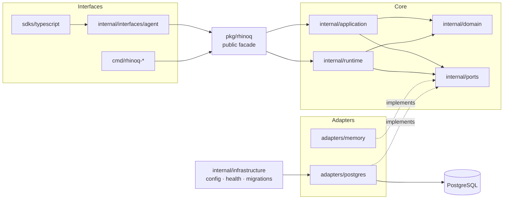
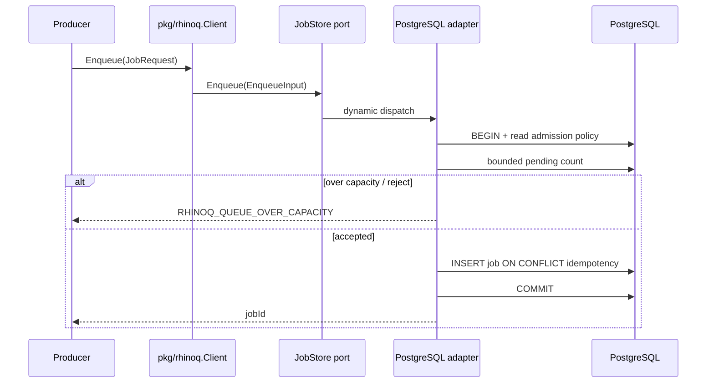
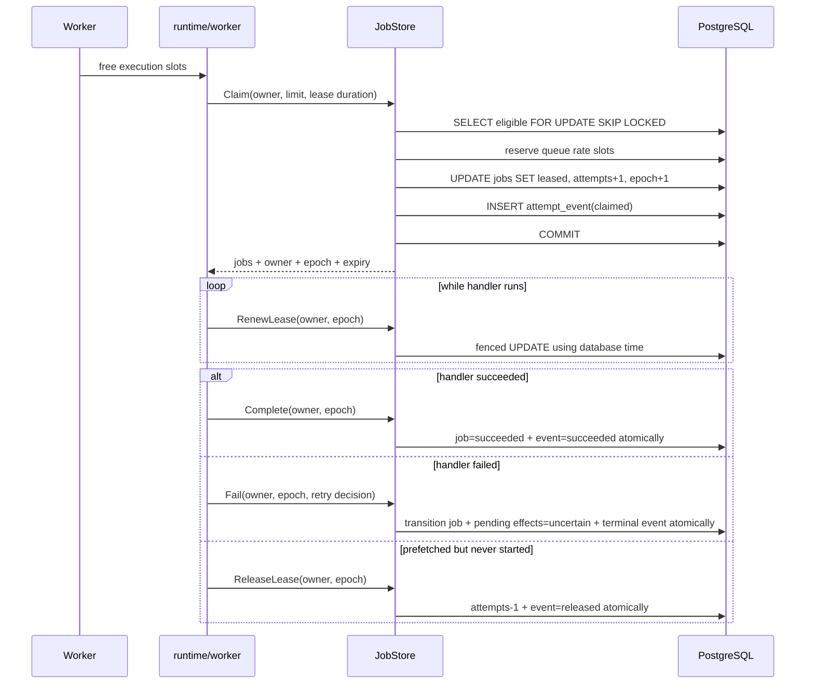
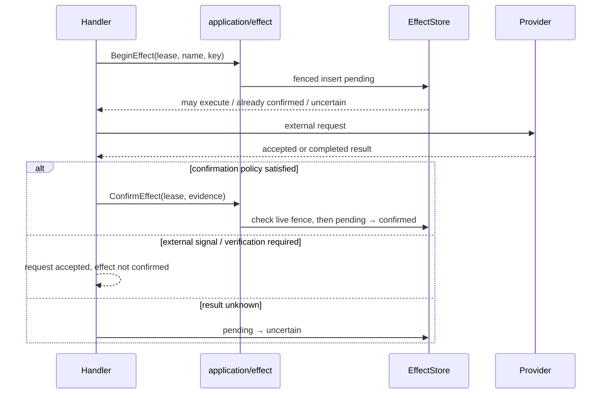
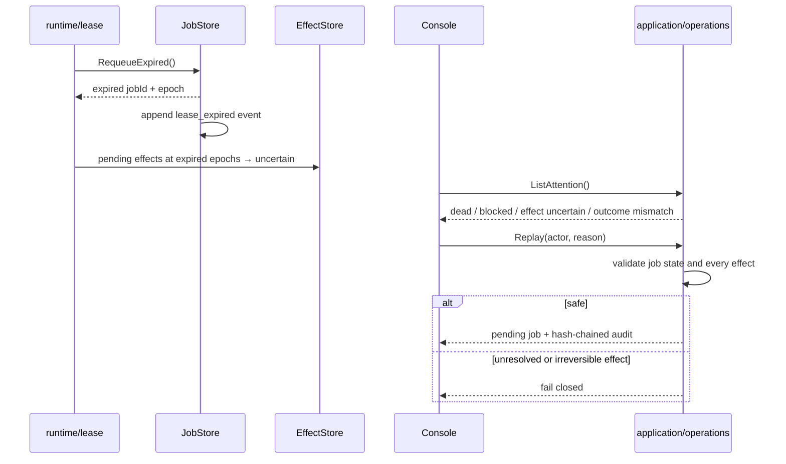

# Runtime flows

Tài liệu này là bản đồ từ luồng sang package và bảng dữ liệu hiện có. Khi code đổi, sequence tương ứng phải đổi cùng pull request; không vẽ một kiến trúc “mong muốn” khác với implementation.

## 1. Ranh giới tầng

Quy tắc review: interface không đọc store; domain không import port/adapter; adapter không gọi ngược application; SDK không chứa state machine, retry engine, lease hoặc Effect Ledger.

## 2. Enqueue có admission và idempotency

Ứng dụng ở ngôn ngữ khác có thể gọi `rhinoq.enqueue()` trong transaction nghiệp vụ. Function vẫn ghi vào cùng `public.rhinoq_jobs`, kiểm allowlist, role, payload, class và priority.

## 3. Claim, fencing và attempt evidence

`attempt_number` là execution budget; một reservation được release có thể trả lại số này. `lease_epoch` không bao giờ giảm và vẫn phân biệt được hai reservation. Timeline public: `Client.AttemptTimeline` hoặc `GET /v1/jobs/{id}/attempts`.

## 4. Effect: accepted khác confirmed

Ba mốc không được gộp: request accepted → effect confirmed → business outcome achieved.

## 5. Lease expiry và recovery

## 6. Dữ liệu theo vai trò

| Vai trò | Bảng | Quy tắc |
|---|---|---|
| Hot state | `rhinoq_jobs`, `rhinoq_queue_controls` | update nhỏ, claim index hẹp, mọi execution write có owner+epoch fence |
| Evidence | `rhinoq_attempt_events`, `rhinoq_effects`, `rhinoq_outcomes`, `rhinoq_audit` | timeline theo database time; attempt events không update |
| Delivery | `rhinoq_outbox` | publish ngoài transaction nhưng intent commit atomically |
| SQL boundary | `rhinoq.job_allowlist` | giới hạn job name/role/payload cho transactional enqueue |

Console/read model tương lai chỉ gọi application/public API. Khi history lớn, projection được xây từ evidence; không thêm truy vấn lịch sử nặng vào hot claim path.
