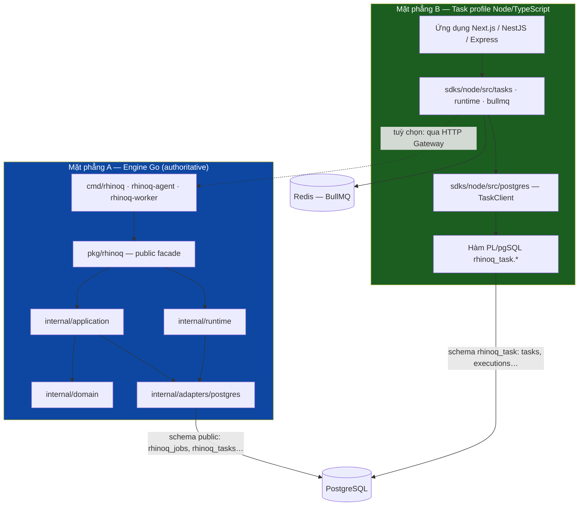
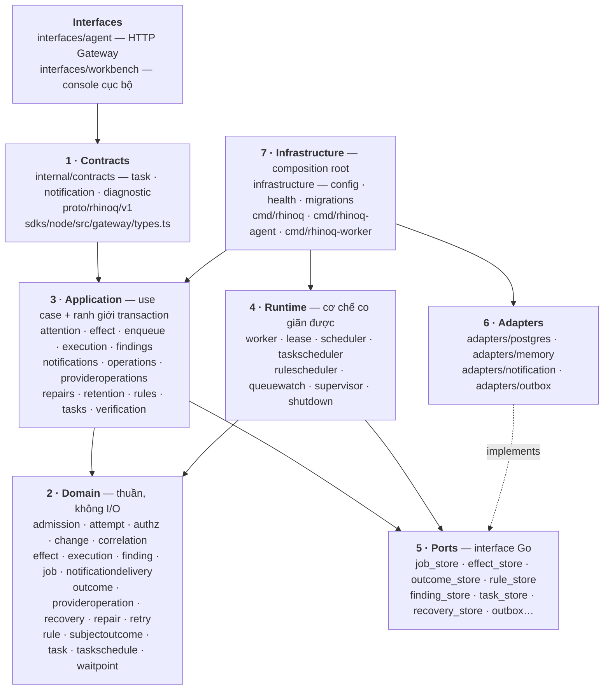
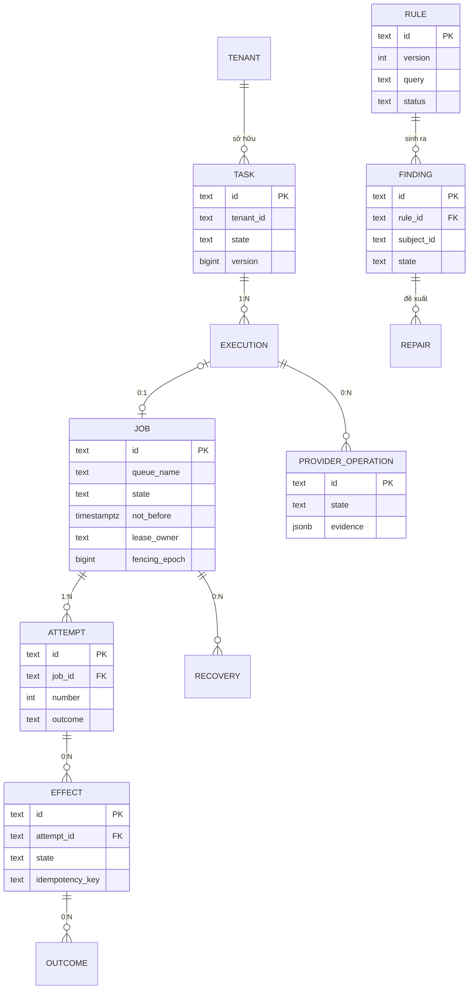
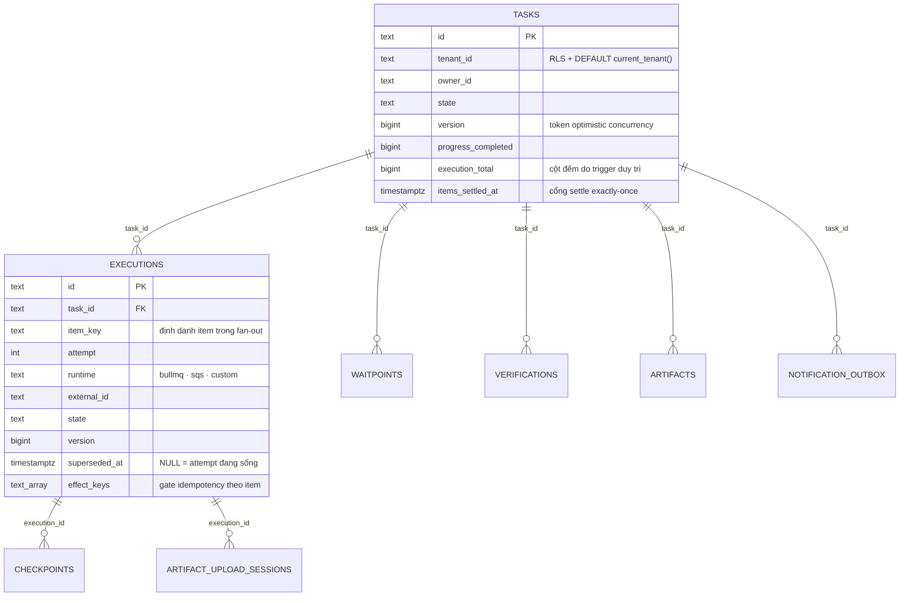
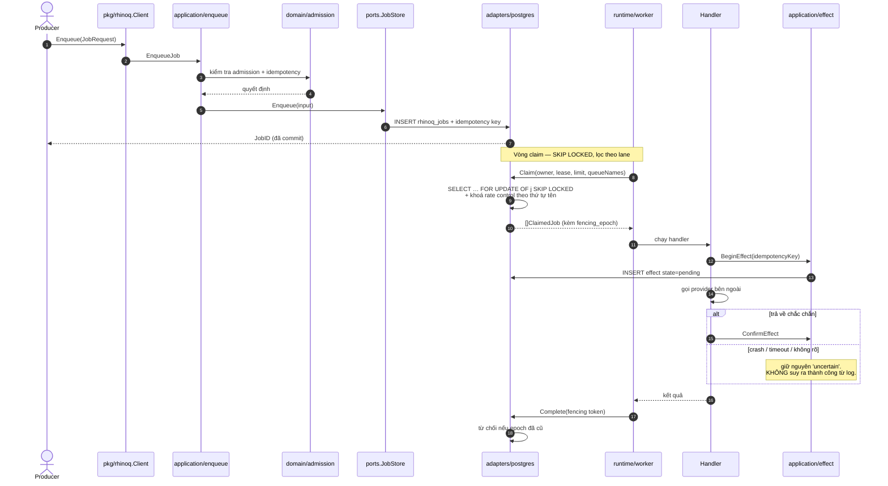
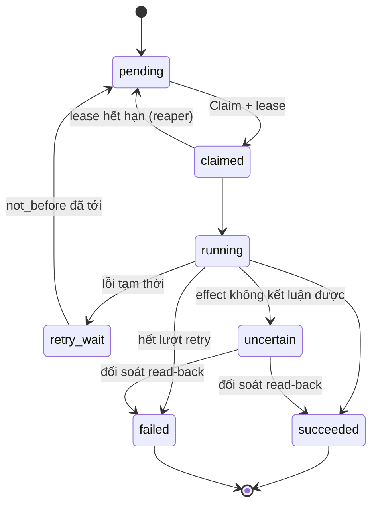
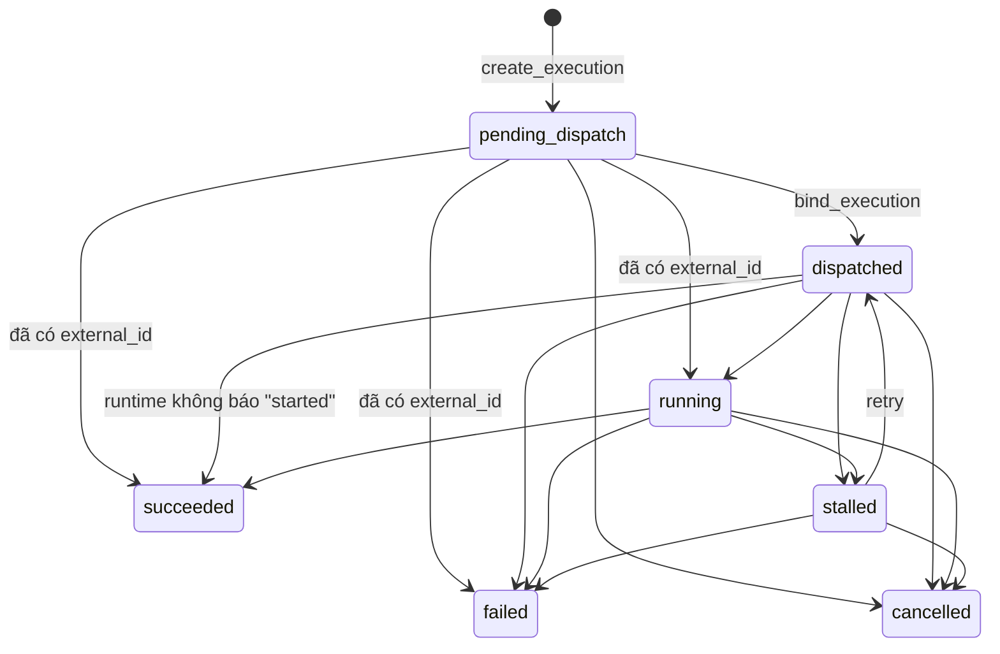
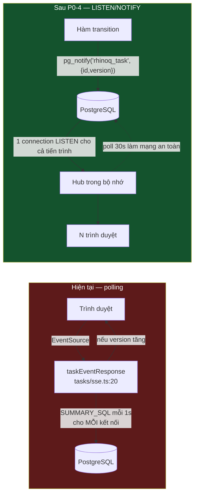
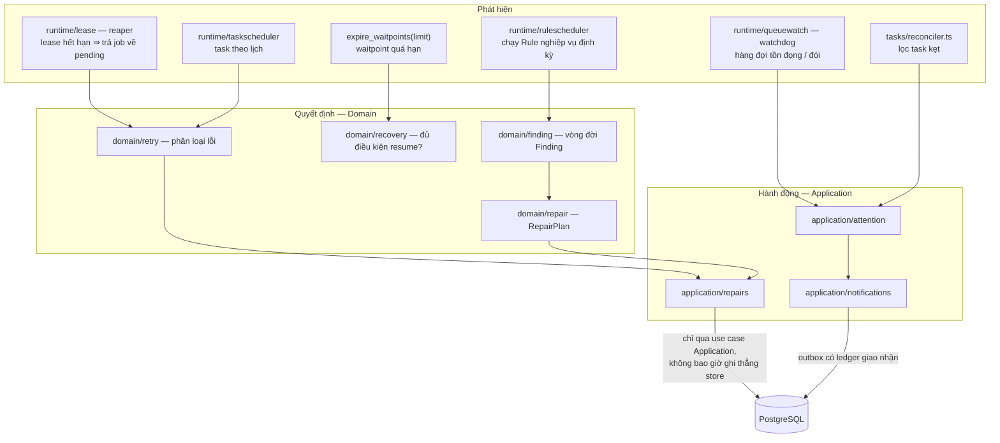
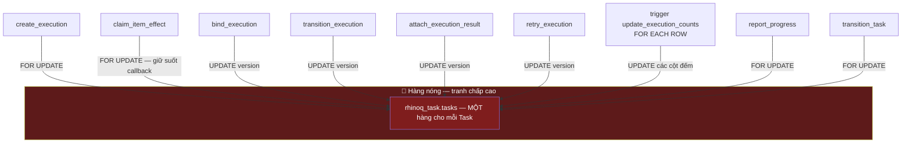

# RhinoQ — Luồng và quan hệ giữa các tầng xử lý

Bản đồ đầy đủ của ứng dụng: có những mặt phẳng nào, mỗi tầng gồm package nào, dữ
liệu đi theo đường nào, và **ở đâu có khoá**.

Khác biệt so với các tài liệu sẵn có:

| Tài liệu | Phạm vi |
|---|---|
| [`ARCHITECTURE.md`](../../ARCHITECTURE.md) | Quy tắc và ranh giới — *phải* như thế nào |
| [`docs/runtime-flows.md`](../runtime-flows.md) | Sequence của engine Go |
| **Tài liệu này** | **Cả hai mặt phẳng (Go engine + Node Task profile), quan hệ dữ liệu, và bản đồ khoá** |

Bản đồ khoá ở §8 là phần dùng chung với
[kế hoạch nâng cấp hiệu năng](./nang-cap-hieu-nang-va-bao-mat.md): nó chỉ ra chính
xác từng điểm ngắt mạch nằm ở tầng nào.

---

## 1. Hai mặt phẳng, không phải một

Đây là điều dễ hiểu sai nhất về RhinoQ. Có **hai** đường chạy độc lập, dùng **hai**
lược đồ dữ liệu khác nhau, và chúng gặp nhau ở PostgreSQL chứ không gọi lẫn nhau.



| | Mặt phẳng A (Go) | Mặt phẳng B (Node) |
|---|---|---|
| Schema | `public.rhinoq_*` | `rhinoq_task.*` |
| Bảng chính | `rhinoq_jobs`, `rhinoq_tasks`, `rhinoq_task_executions` | `rhinoq_task.tasks`, `rhinoq_task.executions` |
| Vận chuyển | PostgreSQL (`SKIP LOCKED`) | BullMQ/Redis, hoặc runtime tuỳ chọn |
| Máy trạng thái ở đâu | `internal/domain` (Go) | Hàm PL/pgSQL trong DB |
| Sở hữu tính đúng đắn | Go | **PostgreSQL** (không phải Node) |
| Điểm vào | `pkg/rhinoq.Client` | `TaskClient` |

**Quy tắc bất biến:** SDK Node không chứa máy trạng thái, không quyết định retry,
không sở hữu Effect Ledger. Khi Node cần một quyết định, nó gọi một hàm PL/pgSQL
hoặc gọi Gateway. Đây là lý do `sdks/node/src/postgres/task-schema.ts` chứa 2,390
dòng SQL: logic nằm ở đó, không nằm trong TypeScript.

---

## 2. Bảy tầng và các package thuộc về từng tầng



### Quy tắc phụ thuộc — được kiểm tra tự động

`tests/unit/architecture_test.go` là cổng chặn. Thêm ranh giới mới thì thêm luật
vào đó, đừng lách bằng một package tiện ích dùng chung.

```text
interfaces → pkg/rhinoq (facade) → application → domain
                                 └→ runtime     → domain
application, runtime → ports ← adapters
infrastructure → composition root + adapters
```

| Cấm | Vì sao |
|---|---|
| `domain` import port hoặc adapter | Domain phải test được không cần DB |
| `interfaces` đọc thẳng store | Bỏ qua kiểm tra quyền và audit của Application |
| `adapters` import nội bộ `application` | Phụ thuộc vòng; adapter phải thay được |
| SDK chứa máy trạng thái | Sẽ có hai nguồn sự thật, và chúng sẽ lệch nhau |
| Phụ thuộc ngược trực tiếp | Dùng event hoặc port |

---

## 3. Mô hình dữ liệu

### 3.1. Mặt phẳng A — engine Go



**Bốn máy trạng thái độc lập:** Task, Execution/Job, Effect, Outcome. Chúng không
kế thừa trạng thái của nhau. Đây là điều làm cho *"job chạy xong"* và *"tiền đã
trừ"* là hai câu khác nhau — chính là điểm mấu chốt của sản phẩm.

### 3.2. Mặt phẳng B — Task profile Node



**Ba bất biến quan trọng nhất:**

1. `tenant_id` có `DEFAULT rhinoq_task.current_tenant()` và được RLS `FORCE` bảo
   vệ. Một predicate bị quên **không** làm rò dữ liệu chéo tenant.
2. `superseded_at IS NULL` xác định attempt đang sống. Unique index từng phần
   `executions_runtime_ref_live_unique` cho phép BullMQ tái sử dụng job id khi
   retry mà vẫn giữ được lịch sử attempt.
3. `items_settled_at` là cổng exactly-once cho tín hiệu "batch xong". Nó *không*
   suy ra từ cột đếm — xem §5.

---

## 4. Luồng A — vòng đời một Job trên engine Go



**Fencing là điểm quan trọng nhất trong sơ đồ này.** Một worker mất lease rồi tỉnh
lại vẫn cầm dữ liệu cũ. `fencing_epoch` làm cho lệnh ghi muộn của nó bị từ chối
tại tầng dữ liệu, chứ không dựa vào việc tiến trình đó tự biết mình đã hết hạn.

### Máy trạng thái Job



`uncertain` là trạng thái hạng nhất, không phải một biến thể của `failed`. Nó là
lý do fault-test Stripe cho kết quả đúng: hệ thống ghi nhận *"tôi không biết"* và
đi đối soát, thay vì đoán.

---

## 5. Luồng B — fan-out trên Task profile Node

Đây là đường chạy nóng nhất và cũng là nơi tập trung các điểm ngắt mạch.

```mermaid
sequenceDiagram
  autonumber
  actor U as Ứng dụng
  participant TC as TaskClient
  participant FN as Hàm rhinoq_task.*
  participant T as bảng tasks
  participant E as bảng executions
  participant BR as BullMQTaskBridge
  participant Q as BullMQ / Redis
  participant WK as Worker BullMQ

  U->>TC: createTask({ id, type, ownerId })
  TC->>FN: rhinoq_task.create_task(…)
  FN->>T: INSERT (tenant_id = current_tenant())

  loop mỗi item trong batch
    U->>TC: createTaskExecution(taskId, itemKey)
    TC->>FN: rhinoq_task.create_execution(…)
    FN->>T: 🔒 SELECT … FOR UPDATE (khoá hàng cha)
    FN->>E: INSERT state='pending_dispatch'
    FN->>T: UPDATE version = version + 1
    Note right of T: ⚠️ N2 — mỗi item chạm hàng cha
  end

  U->>Q: Queue.addBulk(items)
  Q-->>BR: biên nhận job id
  BR->>FN: bind_execution(externalId)
  FN->>E: state='dispatched'
  FN->>T: UPDATE version + 1

  Note over BR: Biên nhận không gắn bền được ⇒ 'uncertain',<br/>KHÔNG retry. Đối soát phải gắn trước.

  WK->>WK: chạy handler
  WK->>TC: onceForItem(executionId, effectKey, fn)
  TC->>FN: BEGIN; claim_item_effect(…)
  FN->>T: 🔒 FOR UPDATE — giữ tới COMMIT
  TC->>U: fn(connection) ← code nghiệp vụ chạy ở đây
  Note over T,U: 🔴 N1 — khoá hàng cha bị giữ<br/>suốt thời gian chạy nghiệp vụ.<br/>Toàn bộ fan-out tuần tự hoá.
  TC->>FN: COMMIT

  WK-->>BR: completed / failed
  BR->>FN: transition_execution(→ succeeded)
  FN->>E: UPDATE state
  FN->>T: UPDATE version + 1 (+ trigger đếm)
  BR->>FN: settle_items(taskId)
  FN->>T: đặt items_settled_at nếu mọi item đã kết thúc
  Note right of T: version cố ý KHÔNG tăng —<br/>tránh bão version conflict lúc item cuối về
  BR-->>U: gọi lại onSettled đúng một lần
```

### Tại sao `settle_items` đọc hàng sống thay vì cột đếm

Chi tiết này đáng ghi lại vì nó là một bài học đã trả giá, ghi trong comment của
`TASK_SCHEMA_V7_SQL`:

Cột `execution_*` đếm **mọi attempt từng tồn tại**, kể cả attempt đã bị supersede.
Khi retry biến attempt cũ thành `stalled`, bộ đếm `execution_stalled` không bao giờ
trở về 0 — và batch không bao giờ settle. Nên `settle_items` phải hỏi *"còn item
nào chưa xong không"* trên các hàng `superseded_at IS NULL`, tính theo **item**
chứ không theo **attempt**.

Exactly-once vẫn đến từ `items_settled_at IS NULL`, không đến từ việc đếm.

### Máy trạng thái Execution



Các cạnh "tắt" (`pending_dispatch → succeeded`, `dispatched → succeeded`) tồn tại
vì lý do thực tế: worker BullMQ nhanh có thể hoàn thành job **trước khi** lệnh
bind kịp commit, và webhook thì không bao giờ báo "started". Từ chối các cạnh này
làm item kẹt vĩnh viễn — và kéo cả batch kẹt theo.

---

## 6. Luồng realtime



| | Hiện tại | Sau P0-4 |
|---|---|---|
| Truy vấn/giây với 1,000 client | ~1,000 | ~0,03 (một poll an toàn 30 s) |
| Độ trễ nhìn thấy thay đổi | tới 1 s | tới ~vài ms |
| Tải DB theo số client | tuyến tính | hằng số |

Các đường realtime khác dùng chung khuôn: `tasks/websocket.ts` (đã có sẵn hook
"event-driven fast path" chờ được nối vào NOTIFY), `tasks/list-store.ts`,
`workbench/handler.ts`, và `tasks/react.ts` cho phía React.

---

## 7. Luồng khôi phục và đối soát



**Ràng buộc bất biến:** control plane (Workbench, CLI, Gateway) *quan sát* và *đề
nghị hành động*. Nó không tự ghi vào store. Mọi hành động sửa chữa đi qua use case
của Application, kèm actor, lý do và dữ liệu audit. Đây là điều làm cho một thao
tác sửa lỗi thủ công vẫn để lại bằng chứng.

---

## 8. Bản đồ khoá — nơi hệ thống thực sự tuần tự hoá

Đây là bảng cần đọc trước khi thay đổi bất cứ thứ gì trên đường nóng.



| Khoá | Ở đâu | Phạm vi | Giữ bao lâu | Rủi ro |
|---|---|---|---|---|
| `tasks … FOR UPDATE` | `claim_item_effect` | hàng Task cha | **suốt callback nghiệp vụ** | 🔴 tuần tự hoá toàn fan-out — N1 |
| `UPDATE tasks SET version+1` | 6 hàm transition + trigger | hàng Task cha | tới hết transaction | 🔴 hot row + bloat — N2 |
| `pg_advisory_xact_lock(commandID)` | `task_store.go:168` | theo lệnh | tới hết transaction | 🟢 đúng phạm vi |
| `pg_advisory_xact_lock(findingKey)` | `finding_store.go:244` | theo finding | tới hết transaction | 🟢 đúng phạm vi |
| `FOR UPDATE OF j SKIP LOCKED` | `job_store.go:418` | hàng job ứng viên | ngắn | 🟢 đúng mẫu claim |
| `FOR UPDATE` rate controls | `job_store.go:432` | hàng theo lane, sắp thứ tự tên | ngắn | 🟢 thứ tự khoá tránh deadlock |
| `pg_advisory_lock(migration)` | `migrations/runner.go:144` | toàn cục | suốt migration | 🟢 đúng, có chủ đích |
| Projector lease | `postgres/projector-lease.ts` | theo scope | có gia hạn | 🟢 chỉ một writer ghi tiến độ |
| `sync.Mutex` rate limiter | `agent/server.go:508` | **toàn tiến trình** | mỗi request | 🟡 điểm tuần tự hoá — N10 |

**Cách đọc bảng:** mọi thứ màu xanh đều đúng mẫu và có thứ tự khoá nhất quán. Hai
hàng đỏ đều trỏ về **một** hàng dữ liệu duy nhất — `rhinoq_task.tasks` của Task
đang chạy. Đó là điểm ngắt mạch của toàn hệ thống, và nó nằm ở tầng SQL, không nằm
ở tầng ứng dụng.

---

## 9. Bảng tra: tầng → package → bảng dữ liệu

| Tầng | Package Go | Module Node | Bảng chạm tới |
|---|---|---|---|
| Contracts | `internal/contracts/*`, `proto/rhinoq/v1` | `gateway/types.ts` | — |
| Domain | `internal/domain/*` (20 package) | — (cố ý trống) | — |
| Application | `internal/application/*` (13 package) | — | qua ports |
| Runtime | `internal/runtime/*` (8 package) | `runtime/`, `bullmq/` | qua ports |
| Ports | `internal/ports/*` (16 interface) | — | — |
| Adapters | `adapters/{postgres,memory,notification,outbox}` | `postgres/task-client.ts` | trực tiếp |
| Infrastructure | `infrastructure/{config,health,migrations}` | `cli/database-config.ts` | migration |
| Interfaces | `interfaces/{agent,workbench}` | `tasks/http.ts`, `workbench/` | không bao giờ trực tiếp |

---

## 10. Danh sách kiểm tra khi review

Trước khi merge một thay đổi chạm đường nóng:

- [ ] Có thêm lệnh ghi nào vào `rhinoq_task.tasks` trên mỗi item không? *(N2)*
- [ ] Có giữ khoá qua một lời gọi mạng nào không? *(N1)*
- [ ] Lệnh ghi có trả về snapshot đầy đủ không? Nếu có, vì sao cần? *(N3)*
- [ ] Truy vấn mới có nằm trong vòng lặp poll không? *(N4, N7)*
- [ ] Có thêm pool PostgreSQL nào không? Đã đặt `MaxOpenConns` chưa? *(N5)*
- [ ] Đường đọc mới có predicate tenant **và** dựa được vào RLS không? *(N6, S1)*
- [ ] Có `lock_timeout` cho transaction có thể phải chờ không? *(N8)*
- [ ] `tests/unit/architecture_test.go` còn xanh không?
- [ ] Nếu tuyên bố một con số hiệu năng: script tái lập đã nằm trong repo chưa?

---

## Xem thêm

- [Kế hoạch nâng cấp hiệu năng và bảo mật](./nang-cap-hieu-nang-va-bao-mat.md) —
  phân tích chi tiết từng điểm ngắt mạch và cách sửa.
- [`ARCHITECTURE.md`](../../ARCHITECTURE.md) · [`docs/runtime-flows.md`](../runtime-flows.md)
  · [`docs/failure-semantics.md`](../failure-semantics.md) · [`docs/tenancy.md`](../tenancy.md)
