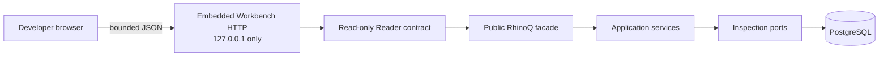

# RhinoQ Workbench

RhinoQ Workbench is the local developer interface for inspecting background
work and its business evidence. It is not a hosted admin product and it does
not introduce another control-plane service.

## Open it

With `RHINOQ_DATABASE_URL` configured and migrations applied:

```bash
rhinoq workbench
```

The command binds an HTTP server to `127.0.0.1:8787` and opens the system
browser. It never listens on a public interface.

Useful development options:

```bash
# See the interface without PostgreSQL
rhinoq workbench --demo

# Keep it in the terminal or use a remote port forward
rhinoq workbench --no-open

# Select another loopback port or start with one queue
rhinoq workbench --port 8790
rhinoq workbench --queue generate-report
```

During repository evaluation, the same command can run from source:

```bash
go run ./cmd/rhinoq workbench --demo
```

Prebuilt CLI binaries have not been released yet. Node.js users will use the
same Go CLI binary once distribution is available; the Workbench does not
require a Node.js frontend server.

See [cli.md](./cli.md) for every Workbench flag, source-install command, exit
code and the boundary between browser reads and explicit CLI writes.

## What developers see

- **Execution worktable:** a dense, sticky-header table for job state, queue,
  correlation, stage, attempts, priority and age.
- **Flow Lens:** COMMIT, RUN, VERIFY and RECOVER stay visible as separate
  stages instead of collapsing everything into “success” or “failure”.
- **Evidence Rail:** selecting a job shows append-only attempt events, declared
  effects, outcome observations and decision audit next to the row.
- **Needs Attention:** execution failures, uncertain effects, outcome
  mismatches and persistent Findings share one bounded inbox.
- **Integrity views:** Findings and Rules are available without switching to a
  different product.
- **Developer ergonomics:** search, queue/state/stage lenses, configurable
  columns, compact/comfortable density, light/dark themes, `J`/`K` navigation,
  `/` search and `Ctrl/Cmd+K` commands.

The defining visual contract is:

```text
request accepted  ≠  effect confirmed  ≠  outcome achieved
```

It is visible in the Evidence Rail because it is also a correctness boundary in
the engine.

## Safety and privacy

Workbench v0 is deliberately read-only:

- it exposes no replay, repair, pause or destructive action;
- list and evidence reads are bounded;
- job payloads are not part of the Workbench DTOs;
- database credentials are never sent to the browser or printed in the source
  label;
- API responses use `Cache-Control: no-store`;
- browser requests must be same-origin and the HTTP Host must resolve to an
  explicit loopback name/address, which closes the common DNS-rebinding path;
- CSP, frame denial, content-type protection and a restrictive permissions
  policy are set on every response.

Mutating operations remain explicit CLI/application commands with the existing
actor, reason and audit requirements. A future write workflow must go through
an application use case; it may not call a store directly from HTTP.

## Architecture



The static HTML, CSS and JavaScript are embedded into the Go binary under
`internal/interfaces/workbench/static`. There is no React runtime, package
manager, external font, icon library or telemetry script. An automated test
holds the embedded frontend below a 160 KiB uncompressed budget; the current
three assets are below 100 KiB.

`cmd/rhinoq` is the composition root. The HTTP package cannot import a
PostgreSQL adapter. Live reads are translated from the public `rhinoq.Client`;
demo reads implement the same Reader contract. This boundary allows a future
read replica or read model without changing the browser protocol.

## Interaction research, not visual copying

The interface combines proven interaction ideas while keeping RhinoQ's own
information architecture, vocabulary, code and assets:

- [Inngest](https://github.com/inngest/inngest) and
  [bull-board](https://github.com/felixmosh/bull-board) demonstrate the value of
  a local browser view near the worker.
- [Temporal UI](https://github.com/temporalio/ui) and its
  [configurable workflow table discussion](https://github.com/temporalio/ui/issues/2577)
  reinforce dense filtering and user-controlled columns.
- [Supabase Studio](https://github.com/supabase/supabase) demonstrates a
  developer-first database surface with command navigation and explicit
  operation review.
- [Grafana](https://github.com/grafana/grafana) demonstrates context-preserving
  inspection rather than forcing developers through disconnected pages.
- [Sentry](https://github.com/getsentry/sentry) demonstrates triage-oriented
  issue streams and regression visibility.
- [Trigger.dev](https://github.com/triggerdotdev/trigger.dev) demonstrates
  searchable run views and observable retry history.

RhinoQ does not copy their layout, code, visual assets or product categories.
Its distinct primitives are the four-stage Flow Lens, the evidence separation,
the business-integrity inbox and the guarded decision audit.

## Current boundary

Implemented now:

- local demo and live PostgreSQL modes;
- jobs, Needs Attention, Findings and Rules;
- per-job attempts, effects, outcomes and replay audit;
- responsive table and Evidence Rail;
- keyboard, theme, density and column preferences;
- security headers and payload-free read models.

Not implemented:

- business-key timeline across multiple jobs and external execution systems;
- write actions in the browser;
- tenant-aware remote hosting or authentication;
- streaming updates and large-history virtualization;
- packaged CLI distribution.

Those omissions are explicit. Workbench v0 makes current evidence easier to use;
it does not pretend the remaining adoption and correlation work is complete.
