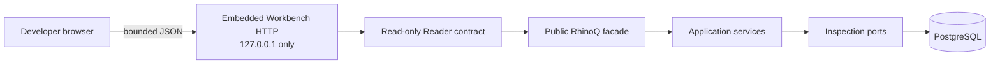

# RhinoQ Workbench

RhinoQ Workbench is the local developer interface for inspecting background
work and its business evidence. It is not a hosted admin product and it does
not introduce another control-plane service.

## Open it

With `RHINOQ_DATABASE_URL` configured and migrations applied:

```bash
rhinoq workbench
```

The command binds an HTTP server to `127.0.0.1:8787` and opens the system
browser. It never listens on a public interface.

Useful development options:

```bash
# See the interface without PostgreSQL
rhinoq workbench --demo

# Keep it in the terminal or use a remote port forward
rhinoq workbench --no-open

# Select another loopback port or start with one queue
rhinoq workbench --port 8790
rhinoq workbench --queue generate-report

# Opt in to recheck and registered safe-repair callbacks
rhinoq workbench --actions
```

During repository evaluation, the same command can run from source:

```bash
go run ./cmd/rhinoq workbench --demo
```

Prebuilt CLI binaries are attached to the
[beta.24 prerelease](https://github.com/madebyduy/RhinoQ/releases/tag/v0.1.0-beta.24).
Node.js users run the same Go CLI binary; Workbench does not require a Node.js
frontend server.

See [cli.md](./cli.md) for every Workbench flag, source-install command, exit
code and the boundary between browser reads and explicit CLI writes.

## What developers see

Node applications that mount `rhinoqApp.http()` get a smaller embedded Task
Workbench at `/admin`. When BullMQ exposes its read methods, that page adds a
Runtime health overview with queue counts, pause state, worker visibility and
optional safe links to an application-owned queue inspector. This is evidence,
not a second control plane: provider failures are redacted and queue mutation
controls are deliberately absent.

- **Execution worktable:** a dense, sticky-header table for job state, queue,
  correlation, stage, attempts, priority and age.
- **Flow Lens:** COMMIT, RUN, VERIFY and RECOVER stay visible as separate
  stages instead of collapsing everything into “success” or “failure”.
- **Evidence Rail:** selecting a job shows append-only attempt events, declared
  effects, outcome observations and decision audit next to the row. On desktop,
  its divider can be dragged or adjusted with the arrow keys to fit long
  identifiers and evidence.
- **Task progress:** a selected job can show worker-reported `completed/total`
  progress and the latest message. When the source does not provide a bounded
  total, the rail says that progress is unavailable; it never fabricates an
  ETA or turns a missing value into `0/0`.
- **Incident Flight Recorder:** queue commit, attempt transitions, external
  effects, outcome verification and operator decisions are rendered as one
  ordered narrative. When two attempts exist, the rail also exposes a bounded
  before/after diff.
- **Needs Attention:** execution failures, uncertain effects, outcome
  mismatches and persistent Findings share one bounded inbox.
- **Integrity views:** Findings and Rules are available without switching to a
  different product. Selecting a Rule opens a read-only detail panel with its
  scope, subject, schedule, version history and related Findings from the
  bounded snapshot. A registered Application Rule tester can run a bounded
  subject preview; the browser never submits SQL.
- **Safe bulk actions:** select a bounded set of Tasks, preview its Safe /
  Uncertain / Blocked grouping, then request a separate approval and execute
  only the safe set through an Application-owned BulkOperator. Uncertain and
  blocked work remains untouched and the post-check result is recorded.
- **Realtime and saved views:** the Workbench emits bounded SSE snapshots with
  reconnect/polling fallback. Queue, stage, state and search filters can be
  saved locally or copied as a shareable URL.
- **Developer ergonomics:** search, queue/state/stage lenses, configurable
  columns, compact/comfortable density, `J`/`K` navigation, `/` search and
  `Ctrl/Cmd+K` commands.
- **Focused navigation:** session safety remains visible beside the connection
  status; the sidebar contains only navigation and queue filters, without
  unavailable estimates or non-actionable status panels.
- **Explicit queue scope:** the sidebar exposes an `All queues` choice, visible
  per-queue counts and a Reset action only while a queue filter is active.
- **Container-aware layout:** the lifecycle summary reflows from four columns
  to two columns and then one based on the actual workspace width, including
  when the evidence rail consumes part of a desktop window.
- **Legible narrow tables:** when the evidence rail narrows the workspace, the
  worktable keeps minimum operational column widths and scrolls internally;
  state and stage badges are never compressed into clipped labels.

The defining visual contract is:

```text
request accepted  ≠  effect confirmed  ≠  outcome achieved
```

It is visible in the Evidence Rail because it is also a correctness boundary in
the engine.

The COMMIT, RUN, VERIFY and RECOVER summary is a stage filter over the bounded
Workbench snapshot, not an individual Task progress bar. It uses one neutral
interaction color so RECOVER is not mistaken for warning severity. A Workbench
Reader may additionally supply bounded `completed/total` progress; when it
does not, the rail explicitly says that progress is unavailable and never
invents an ETA.

## Visual language: Quiet Operations

The Workbench uses a neutral daylight surface and one restrained navy
interaction color. Amber, red and green are reserved for real state, so color
continues to carry operational meaning instead of decoration. The **Proof
Path** is a single quiet line through COMMIT, RUN, VERIFY and RECOVER; it keeps
the lifecycle visible without turning every number into a dashboard card.

Typography uses the Windows-native Segoe UI Variable face for navigation,
metadata, states and identifiers. Weight, color and tabular numerals provide
hierarchy without switching ordinary interface copy into a diagnostic-looking
mono face. The result is dense enough for operators while remaining easy to
scan. This is presentation only: theme does not change state, permissions or
evidence semantics.

Detail sections use an 18 px bold heading, 14 px values, 14 px empty-state
explanations and 12–13 px timeline context at the default browser zoom.
Evidence is treated as primary reading content rather than compressed
dashboard decoration.

## Safety and privacy

Workbench is read-only by default. `--actions` explicitly enables subject
recheck, the registered safe-repair workflow and (when a `BulkOperator` is
provided) Safe Bulk Actions:

- it exposes no replay, pause, arbitrary SQL or unregistered mutation;
- repair requires proposal, dry-run, different approver, reason, fresh
  precondition, application callback and automatic verification;
- bulk actions require Safe / Uncertain / Blocked preview, a separate approver,
  registered handlers and a post-check; uncertain or blocked items are never
  executed;
- list and evidence reads are bounded;
- job payloads are not part of the Workbench DTOs;
- database credentials are never sent to the browser or printed in the source
  label;
- API responses use `Cache-Control: no-store`;
- browser requests must be same-origin and the HTTP Host must resolve to an
  explicit loopback name/address, which closes the common DNS-rebinding path;
- CSP, frame denial, content-type protection and a restrictive permissions
  policy are set on every response.

Every action goes through an application use case; Workbench never calls a
store directly. Without `RHINOQ_REPAIR_CALLBACKS_JSON`, no business repair
handler is registered and preview/execute fail closed.

## Architecture



The static HTML, CSS and JavaScript are embedded into the Go binary under
`internal/interfaces/workbench/static`. There is no React runtime, package
manager, external font, icon library or telemetry script. An automated test
holds the embedded frontend below a 160 KiB uncompressed budget; the current
three assets are below 100 KiB.

`cmd/rhinoq` is the composition root. The HTTP package cannot import a
PostgreSQL adapter. Live reads are translated from the public `rhinoq.Client`;
demo reads implement the same Reader contract. This boundary allows a future
read replica or read model without changing the browser protocol.

## Interaction research, not visual copying

The interface combines proven interaction ideas while keeping RhinoQ's own
information architecture, vocabulary, code and assets:

- [Inngest](https://github.com/inngest/inngest) and
  [bull-board](https://github.com/felixmosh/bull-board) demonstrate the value of
  a local browser view near the worker.
- [Temporal UI](https://github.com/temporalio/ui) and its
  [configurable workflow table discussion](https://github.com/temporalio/ui/issues/2577)
  reinforce dense filtering and user-controlled columns.
- [Supabase Studio](https://github.com/supabase/supabase) demonstrates a
  developer-first database surface with command navigation and explicit
  operation review.
- [Grafana](https://github.com/grafana/grafana) demonstrates context-preserving
  inspection rather than forcing developers through disconnected pages.
- [Sentry](https://github.com/getsentry/sentry) demonstrates triage-oriented
  issue streams and regression visibility.
- [Trigger.dev](https://github.com/triggerdotdev/trigger.dev) demonstrates
  searchable run views and observable retry history.
- The [Anthropic frontend-design skill](https://github.com/anthropics/claude-code/blob/main/plugins/frontend-design/skills/frontend-design/SKILL.md),
  [Emil Kowalski's design-engineering skill](https://github.com/emilkowalski/skill/blob/main/skills/emil-design-eng/SKILL.md)
  and [OpenAI's frontend-skill](https://github.com/openai/skills/blob/main/skills/.curated/frontend-skill/SKILL.md)
  informed the restraint rules: a deliberate art direction, no copied product
  UI, clear type hierarchy and motion only where it clarifies state.

RhinoQ does not copy their layout, code, visual assets or product categories.
Its distinct primitives are the four-stage Flow Lens, the evidence separation,
the business-integrity inbox and the guarded decision audit.

## Current boundary

Implemented now:

- local demo and live PostgreSQL modes;
- jobs, Needs Attention, Findings and Rules;
- per-job attempts, effects, outcomes and replay audit;
- responsive table and Evidence Rail;
- keyboard, theme, density and column preferences;
- security headers and payload-free read models;
- a business-subject investigation view.
- bounded SSE updates with polling fallback, saved/shareable views, Incident
  Flight Recorder spans, Rule test previews and Safe Bulk preview.

## Subject investigation

Selecting a Finding opens the subject it is about, not the job that produced it.
The view answers one question — *what happened to `report_3912`* — by merging
into a single time-ordered narrative:

- a verdict: clean, drift, or unknown;
- every execution that touched the subject, whether RhinoQ ran it or BullMQ,
  Temporal, cron or an application did;
- Effect Ledger entries with their confirmation state;
- observations RhinoQ made and decisions people took, told apart by whether an
  actor is recorded.

The subject history uses a dedicated responsive timeline: event type, event
copy and timestamp keep explicit columns on a wide rail, while timestamps move
below the event copy on a narrow rail instead of overlapping it.

`GET /api/v1/subjects/{type}/{id}` serves it. Type and id are separate path
segments because a subject id may itself contain a slash.

Unknown is its own verdict rather than a shade of clean: an effect whose
execution died has an unknown result, and reporting that as clean would claim
more than RhinoQ knows.

Not implemented:

- tenant-aware remote hosting or authentication;
- large-history virtualization;
- arbitrary SQL, unregistered mutations or automatic repair.

Recheck, guarded business repair and Safe Bulk Actions are implemented only
when `--actions` is supplied and the composition provides the corresponding
Application callbacks. Repair still runs through an allowlisted application
callback with a preview, fresh precondition, different approver, reason,
idempotency token and post-apply verification. Bulk preview remains available
as a bounded read when mutation callbacks are absent. Those boundaries are
explicit: Workbench makes current evidence actionable without pretending to be
a hosted control plane.
